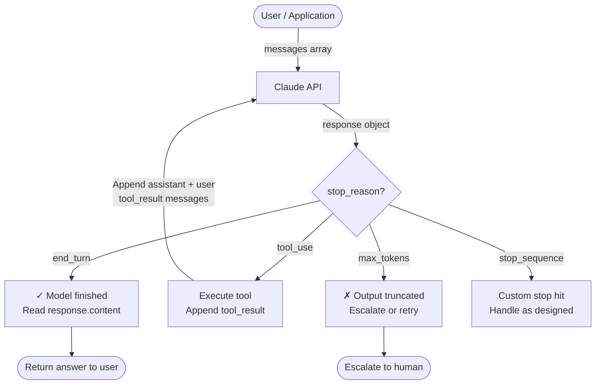
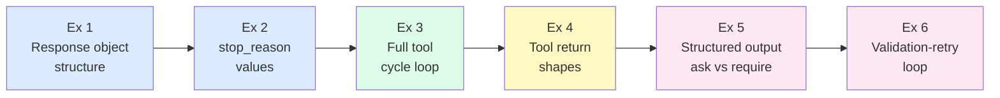
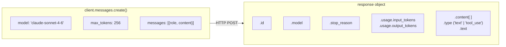
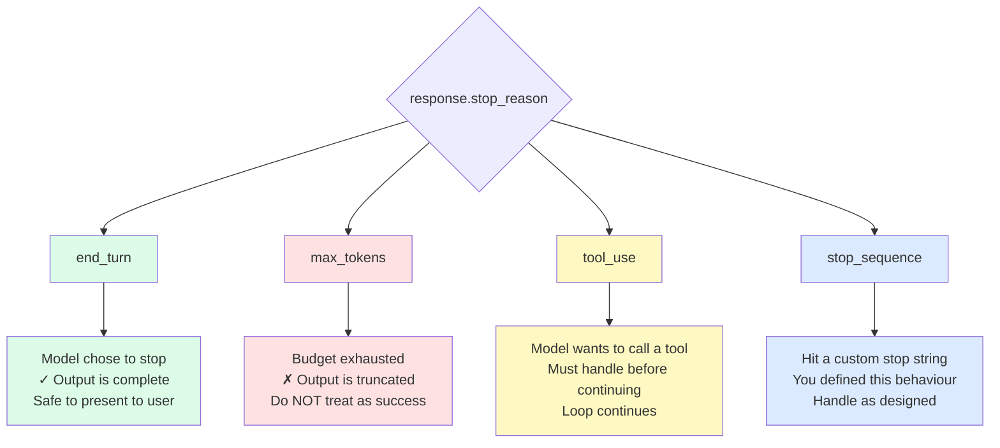
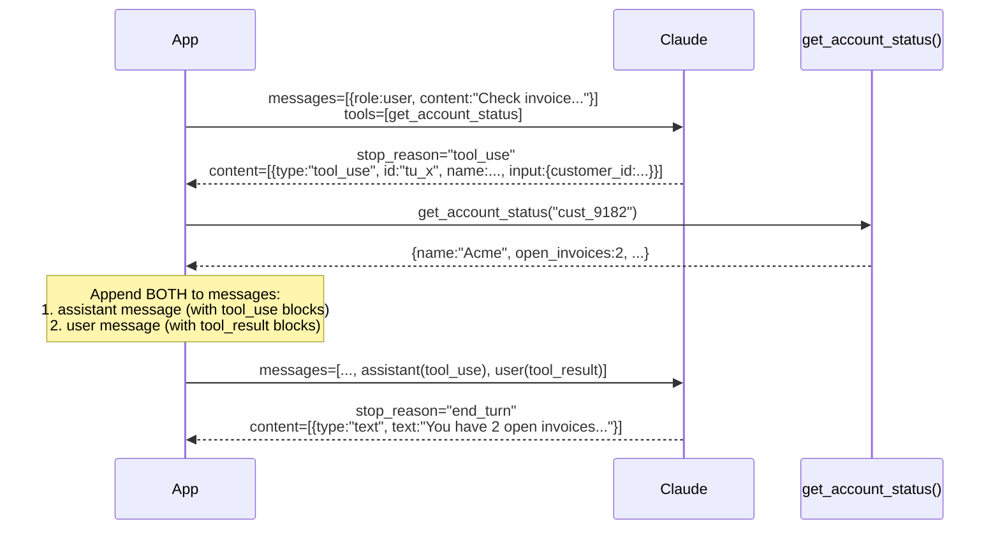
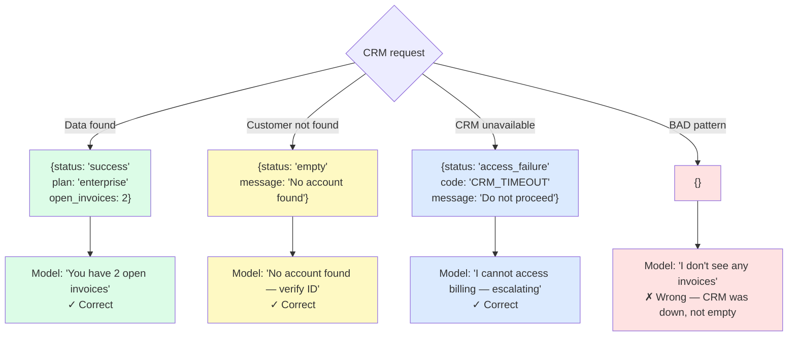
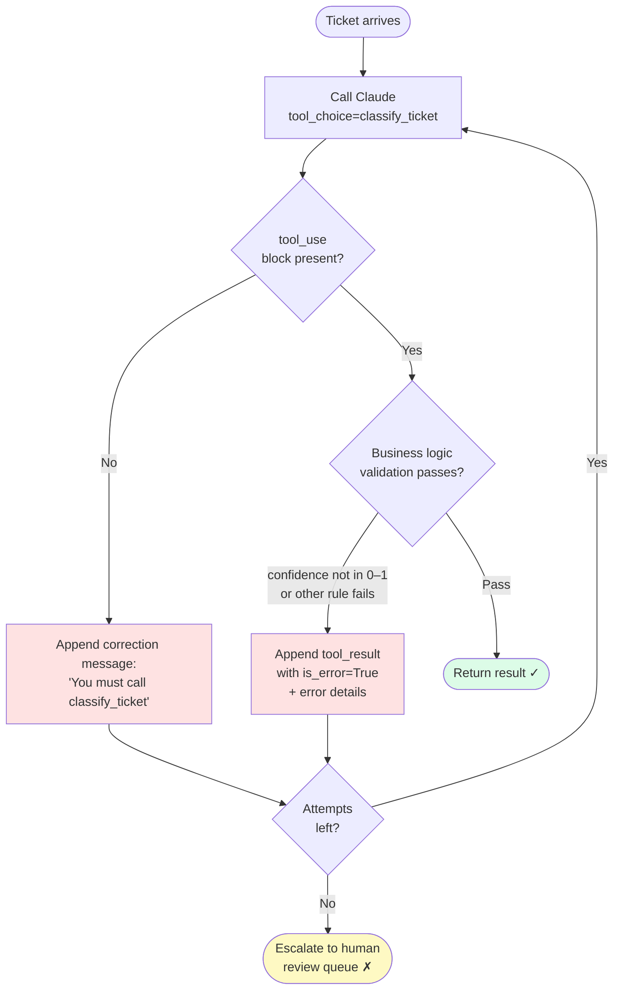

# Week 1 Lab — API Foundations

> **Resolve context:** Before Jade built the resolution agent, she had to understand the primitive she was building on. These exercises cover exactly what she should have mastered before writing a single line of agent code — and what the exam assumes you have fully internalised.

## What You'll Build

A minimal but complete foundation: raw API calls, tool definitions, `stop_reason` handling, and the critical difference between *asking* a model for structured output and *requiring* it. By the end of this lab, you will have written and broken every pattern that appears in Domain 1 and Domain 3.

---

## How It All Fits Together

This is the mental model you are building across all six exercises. Every pattern traces back to this loop:



**Core idea:** The API is stateless. You maintain the conversation by building up the `messages` array yourself. Each round-trip is one inference call. `stop_reason` — not model language — is your control signal.

---

## Exercise Progression



Exercises 1–2 build your mental model of the response object. Exercise 3 builds the agentic loop. Exercises 4–6 harden it.

---

## Prerequisites

```bash
pip install anthropic python-dotenv
```

Create a `.env` file at the project root:

```
ANTHROPIC_API_KEY=sk-ant-...
```

All exercises use `claude-sonnet-4-6`. Run each exercise file independently.

---

## Exercise 1 — Your First API Call

**What it teaches:** The structure of a Claude response. Everything downstream depends on understanding this object.



The `response.content` is a **list** — it can hold text blocks, tool-use blocks, or both. Always iterate over it; never assume `content[0]` is text.

Create `exercise_1_basic_call.py`:

```python
import anthropic
from dotenv import load_dotenv

load_dotenv()
client = anthropic.Anthropic()

response = client.messages.create(
    model="claude-sonnet-4-6",
    max_tokens=256,
    messages=[
        {
            "role": "user",
            "content": "A customer submitted a support ticket saying their invoice is wrong. In one sentence, what should a support agent do first?"
        }
    ]
)

print("=== Full response object ===")
print(f"id:           {response.id}")
print(f"model:        {response.model}")
print(f"stop_reason:  {response.stop_reason}")
print(f"usage:        input={response.usage.input_tokens}, output={response.usage.output_tokens}")
print()
print("=== Content blocks ===")
for block in response.content:
    print(f"type: {block.type}")
    print(f"text: {block.text}")
```

Run it and study the output carefully.

**Questions to answer before moving on:**
1. What is the value of `stop_reason`? What does `end_turn` mean?
2. How many content blocks are in the response?
3. What would happen if you set `max_tokens=10` on this call?

**Try it:** Change `max_tokens` to `10` and run again. Notice that `stop_reason` changes to `max_tokens`. This distinction is critical — an agent loop that stops because of `max_tokens` is not the same as one that stopped because the model finished. If your loop treats both the same way, you have a bug.

---

## Exercise 2 — Understanding `stop_reason`

**What it teaches:** The exact values `stop_reason` can take and what each means for loop control. Domain 1 has multiple questions testing whether you check `stop_reason` or parse language.



**Why this matters for loops:** A loop that exits on `end_turn` **and** `max_tokens` will silently return a truncated, incomplete answer. They are not the same signal.

Create `exercise_2_stop_reason.py`:

```python
import anthropic
from dotenv import load_dotenv

load_dotenv()
client = anthropic.Anthropic()

# Helper to display what we care about
def show_response(label: str, response):
    print(f"\n{'='*50}")
    print(f"Scenario: {label}")
    print(f"stop_reason: {response.stop_reason}")
    print(f"content blocks: {[b.type for b in response.content]}")

# --- Scenario A: Normal completion ---
r = client.messages.create(
    model="claude-sonnet-4-6",
    max_tokens=64,
    messages=[{"role": "user", "content": "Say 'done' and nothing else."}]
)
show_response("Normal completion", r)

# --- Scenario B: Token limit hit ---
r = client.messages.create(
    model="claude-sonnet-4-6",
    max_tokens=5,
    messages=[{"role": "user", "content": "Write a paragraph about support tickets."}]
)
show_response("Token limit hit (max_tokens)", r)

# --- Scenario C: Tool use triggered ---
r = client.messages.create(
    model="claude-sonnet-4-6",
    max_tokens=256,
    tools=[{
        "name": "get_account_status",
        "description": "Retrieve the customer's account status from the CRM.",
        "input_schema": {
            "type": "object",
            "properties": {
                "customer_id": {"type": "string", "description": "The customer's unique ID."}
            },
            "required": ["customer_id"]
        }
    }],
    messages=[{
        "role": "user",
        "content": "Check the account status for customer ID cust_9182 and tell me if they have any open invoices."
    }]
)
show_response("Tool use triggered", r)

# Identify the tool call details when stop_reason is tool_use
if r.stop_reason == "tool_use":
    for block in r.content:
        if block.type == "tool_use":
            print(f"\nTool called: {block.name}")
            print(f"Tool input:  {block.input}")
            print(f"Tool use id: {block.id}")
```

**Key observations:**
- `end_turn` → model finished naturally
- `max_tokens` → output was cut off — the model did not decide to stop
- `tool_use` → model wants to call a tool — you must handle this before continuing

**Exam trap:** A loop that checks `if "I have enough information" in response.text` will fail silently when the model is uncertain. A loop that checks `response.stop_reason == "end_turn"` is deterministic. Always check `stop_reason`.

---

## Exercise 3 — Tool Use: The Full Cycle

**What it teaches:** How a complete tool call cycle works — request, tool_use response, tool result, final answer. This is the foundation of every agentic loop.



**Message history rule:** After a tool call you must append **two** messages — the assistant's `tool_use` turn, then the user's `tool_result` turn. Skipping the assistant message causes an API validation error.

Create `exercise_3_tool_cycle.py`:

```python
import anthropic
import json
from dotenv import load_dotenv

load_dotenv()
client = anthropic.Anthropic()

# Simulate the Resolve CRM — this is a Python function, not Claude
def get_account_status(customer_id: str) -> dict:
    """Simulated CRM lookup."""
    fake_db = {
        "cust_9182": {
            "name": "Acme Corp",
            "plan": "enterprise",
            "open_invoices": 2,
            "outstanding_amount": 4200.00,
            "status": "active"
        },
        "cust_0001": {
            "name": "New Customer Ltd",
            "plan": "starter",
            "open_invoices": 0,
            "outstanding_amount": 0,
            "status": "active"
        }
    }
    return fake_db.get(customer_id, {})  # <-- we'll revisit this return value in Exercise 4

tools = [{
    "name": "get_account_status",
    "description": (
        "Retrieve the current account status for a customer from the CRM, "
        "including their subscription plan, number of open invoices, and "
        "outstanding balance. Call this before responding to any billing inquiry."
    ),
    "input_schema": {
        "type": "object",
        "properties": {
            "customer_id": {
                "type": "string",
                "description": "The customer's unique identifier (format: cust_XXXX)."
            }
        },
        "required": ["customer_id"]
    }
}]

def run_agent(customer_id: str, ticket_text: str):
    print(f"\n{'='*60}")
    print(f"Ticket: {ticket_text}")
    print(f"Customer ID: {customer_id}")

    messages = [{"role": "user", "content": ticket_text}]
    iteration = 0
    max_iterations = 5  # Guard against infinite loops

    while iteration < max_iterations:
        iteration += 1
        print(f"\n--- Iteration {iteration} ---")

        response = client.messages.create(
            model="claude-sonnet-4-6",
            max_tokens=512,
            tools=tools,
            system=f"You are a support agent for Resolve. The current ticket is from customer ID {customer_id}. Always check their account status before responding to billing questions.",
            messages=messages
        )

        print(f"stop_reason: {response.stop_reason}")

        # The loop terminates when the model has finished — not when it says so
        if response.stop_reason == "end_turn":
            print("\n✓ Agent finished.")
            for block in response.content:
                if block.type == "text":
                    print(f"\nFinal reply:\n{block.text}")
            break

        # Handle tool calls
        if response.stop_reason == "tool_use":
            # Add the assistant's response (with tool use blocks) to message history
            messages.append({"role": "assistant", "content": response.content})

            tool_results = []
            for block in response.content:
                if block.type == "tool_use":
                    print(f"Tool call: {block.name}({block.input})")

                    # Execute the actual tool
                    if block.name == "get_account_status":
                        result = get_account_status(block.input["customer_id"])
                    else:
                        result = {"error": "unknown tool"}

                    print(f"Tool result: {result}")

                    tool_results.append({
                        "type": "tool_result",
                        "tool_use_id": block.id,
                        "content": json.dumps(result)
                    })

            # Add tool results to message history
            messages.append({"role": "user", "content": tool_results})

        # Unexpected stop_reason — treat as failure, not success
        elif response.stop_reason == "max_tokens":
            print("✗ Hit token limit mid-response. Escalating.")
            break

    else:
        print(f"✗ Max iterations ({max_iterations}) reached. Escalating.")


# Run two scenarios
run_agent("cust_9182", "Hi, I received an invoice but I thought I already paid. Can you check?")
run_agent("cust_0001", "What plan am I currently on?")
```

**Observe:**
1. The loop is driven by `stop_reason`, not by model language
2. The `max_iterations` guard is non-negotiable — without it, a loop can run forever
3. Message history accumulates: user → assistant (with tool_use) → user (with tool_result) → assistant

---

## Exercise 4 — The Two Faces of Empty

**What it teaches:** Why `{}` is the most dangerous return value a tool can produce. This is the root cause of Resolve's Chapter 4 incident — and a common wrong answer on the exam.



**Design rule:** Every tool must return a discriminated response with a `status` field. The model cannot distinguish "no data" from "call failed" unless you tell it.

Create `exercise_4_empty_vs_failure.py`:

```python
import anthropic
import json
from dotenv import load_dotenv

load_dotenv()
client = anthropic.Anthropic()

# Version A — the bad version (what Resolve had before the incident)
def get_account_status_bad(customer_id: str) -> dict:
    """Returns {} on error. The model cannot tell if the customer has no data
    or if the CRM is unavailable."""
    crm_available = False  # Simulating a CRM outage

    if not crm_available:
        return {}  # Silent failure — this is the bug

    return {"plan": "enterprise", "open_invoices": 2}

# Version B — the correct version (after the incident)
def get_account_status_good(customer_id: str) -> dict:
    """Returns typed response shapes the model can reason about."""
    crm_available = False  # Same CRM outage

    if not crm_available:
        return {
            "status": "access_failure",
            "code": "CRM_TIMEOUT",
            "message": "CRM is currently unavailable. Do not proceed with billing decisions."
        }

    if customer_id not in ["cust_9182", "cust_0001"]:
        return {
            "status": "empty",
            "message": "No account found for this customer ID."
        }

    return {
        "status": "success",
        "plan": "enterprise",
        "open_invoices": 2,
        "outstanding_amount": 4200.00
    }

tools = [{
    "name": "get_account_status",
    "description": (
        "Retrieve account status from CRM. "
        "Returns a status field: 'success' with account data, "
        "'access_failure' if the CRM is unavailable (do NOT make billing decisions — escalate), "
        "or 'empty' if no account exists for this customer ID."
    ),
    "input_schema": {
        "type": "object",
        "properties": {
            "customer_id": {"type": "string"}
        },
        "required": ["customer_id"]
    }
}]

def run_with_tool_version(label: str, tool_fn):
    print(f"\n{'='*60}")
    print(f"Version: {label}")

    messages = [
        {"role": "user", "content": "I think I have an unpaid invoice. Customer ID is cust_9182."}
    ]

    response = client.messages.create(
        model="claude-sonnet-4-6",
        max_tokens=512,
        tools=tools,
        messages=messages
    )

    if response.stop_reason == "tool_use":
        messages.append({"role": "assistant", "content": response.content})

        for block in response.content:
            if block.type == "tool_use":
                result = tool_fn(block.input["customer_id"])
                print(f"Tool returned: {result}")

                messages.append({
                    "role": "user",
                    "content": [{
                        "type": "tool_result",
                        "tool_use_id": block.id,
                        "content": json.dumps(result)
                    }]
                })

        final = client.messages.create(
            model="claude-sonnet-4-6",
            max_tokens=512,
            tools=tools,
            messages=messages
        )

        for block in final.content:
            if block.type == "text":
                print(f"\nAgent reply:\n{block.text}")

run_with_tool_version("BAD  — {} on CRM failure", get_account_status_bad)
run_with_tool_version("GOOD — typed failure response", get_account_status_good)
```

**What to observe:** With Version A, the agent receives `{}` and interprets silence as a clean slate — it tells the customer it doesn't see any invoices. With Version B, the agent receives an explicit `access_failure` status and escalates instead of guessing.

**Exam rule:** A tool that returns `{}` on error is worse than a tool that raises an exception. At least an exception is visible. `{}` is a lie dressed as data.

---

## Exercise 5 — Structured Output: Asked vs. Required

**What it teaches:** The central lesson of Chapter 3 — the difference between *asking* a model for structured output and *requiring* it via `tool_use`. This is one of the most common wrong answers on the exam.

```mermaid
flowchart LR
    subgraph A ["Approach A — Ask for JSON in prompt"]
        direction TB
        A1["system: 'Always respond\nwith a JSON object'"] --> A2[Claude]
        A2 --> A3{"What did\nClaude return?"}
        A3 -->|"Sometimes"| A4["Raw JSON\n✓ Parses OK"]
        A3 -->|"Sometimes"| A5["```json\n{...}\n```\n✗ json.loads fails"]
        A3 -->|"Sometimes"| A6["'Sure! Here is the JSON:'\n{...}\n✗ json.loads fails"]
    end

    subgraph B ["Approach B — Require via tool_use"]
        direction TB
        B1["tool_choice:\n{type:'tool', name:'classify_ticket'}"] --> B2[Claude]
        B2 --> B3["stop_reason = 'tool_use'\nblock.input = validated dict"]
        B3 --> B4["json schema enforced\nby API\n✓ Always parseable"]
    end

    style A4 fill:#dcfce7
    style A5 fill:#fee2e2
    style A6 fill:#fee2e2
    style B4 fill:#dcfce7
```

**Key difference:** `tool_choice: {"type": "tool", "name": "..."}` is a **guarantee** enforced by the API. A system prompt instruction is a **request** — the model may or may not follow it, and variance increases under load.

Create `exercise_5_structured_output.py`:

```python
import anthropic
import json
from dotenv import load_dotenv

load_dotenv()
client = anthropic.Anthropic()

TICKET = "My billing amount this month is wrong. I was charged €450 but my plan should be €300."

# --- Approach A: Ask for JSON in the prompt ---
# This is what Resolve did before the Chapter 3 incident.
def approach_a_ask_for_json():
    print("\n=== Approach A: Ask for JSON in prompt ===")
    print("(Run this 3 times — notice the output varies)")

    response = client.messages.create(
        model="claude-sonnet-4-6",
        max_tokens=512,
        system=(
            "You are a support ticket classifier. "
            "Always respond with a JSON object with these exact fields: "
            "decision (string: 'auto_resolve' or 'escalate'), "
            "confidence (float 0.0-1.0), "
            "reason (string)."
            # The model MAY comply. But it is not required to.
            # A warm preamble, a markdown code block, or an explanation
            # can all appear instead — and will break any downstream parser.
        ),
        messages=[{"role": "user", "content": TICKET}]
    )

    raw = response.content[0].text
    print(f"Raw output:\n{raw}")

    try:
        # This will fail if the model wrapped the JSON in markdown
        data = json.loads(raw)
        print(f"\n✓ Parsed successfully: {data}")
    except json.JSONDecodeError as e:
        print(f"\n✗ Parse failed: {e}")
        print("→ The model gave you something other than raw JSON.")
        print("→ In production, this ticket was silently dropped or misrouted.")

# --- Approach B: Require structure via tool_use ---
# The model MUST call this tool to end the turn.
# There is no valid path where it returns unstructured text.
def approach_b_require_via_tool():
    print("\n=== Approach B: Require via tool_use ===")

    response = client.messages.create(
        model="claude-sonnet-4-6",
        max_tokens=512,
        tools=[{
            "name": "classify_ticket",
            "description": (
                "Classify the support ticket and determine the resolution path. "
                "Call this tool for every ticket — it is the only valid way to complete ticket processing."
            ),
            "input_schema": {
                "type": "object",
                "properties": {
                    "decision": {
                        "type": "string",
                        "enum": ["auto_resolve", "escalate"],
                        "description": "Whether to auto-resolve or escalate to a human agent."
                    },
                    "confidence": {
                        "type": "number",
                        "description": "Confidence score between 0.0 and 1.0."
                    },
                    "reason": {
                        "type": "string",
                        "description": "One-sentence explanation of the decision."
                    },
                    "escalation_team": {
                        "type": "string",
                        "enum": ["billing", "technical", "account_management"],
                        "description": "Required if decision is 'escalate'. The team to route to."
                    }
                },
                "required": ["decision", "confidence", "reason"]
            }
        }],
        # Force the model to use this specific tool
        tool_choice={"type": "tool", "name": "classify_ticket"},
        messages=[{"role": "user", "content": TICKET}]
    )

    print(f"stop_reason: {response.stop_reason}")

    for block in response.content:
        if block.type == "tool_use":
            print(f"\n✓ Tool called: {block.name}")
            print(f"Structured output: {json.dumps(block.input, indent=2)}")

            # This will never fail — the schema was enforced by the API
            decision = block.input["decision"]
            confidence = block.input["confidence"]
            reason = block.input["reason"]
            escalation_team = block.input.get("escalation_team")

            print(f"\nRouting decision: {decision} (confidence: {confidence:.0%})")
            if escalation_team:
                print(f"Escalate to: {escalation_team}")
            print(f"Reason: {reason}")


# Run both
approach_a_ask_for_json()
approach_b_require_via_tool()
```

**What to observe:**
- Approach A is fragile. Run it multiple times — sometimes the model wraps the JSON in a markdown code block, sometimes it adds a preamble sentence, sometimes it works fine. The downstream parser sometimes succeeds, sometimes fails. Production breakage is intermittent, which is the worst kind.
- Approach B is deterministic. The schema is enforced by the API. `block.input` is always a valid dict matching the schema. The downstream parser never breaks.

**Exam rule:** `tool_choice: {"type": "tool", "name": "..."}` forces the model to call that specific tool. This is the correct pattern for any workflow step where you need a guaranteed output format.

---

## Exercise 6 — Building a Validation-Retry Loop

**What it teaches:** What to do when structured output validation fails despite your best efforts — and how to build a retry loop that doesn't mask failures.



**Three-layer safety:**
1. **API schema** — enforces field types and required fields (handled by the API)
2. **Business rules** — range checks, cross-field logic (handled in your code)
3. **Retry budget** — exhausted retries go to humans, never silently succeed

Create `exercise_6_retry_loop.py`:

```python
import anthropic
import json
from dotenv import load_dotenv

load_dotenv()
client = anthropic.Anthropic()

def classify_ticket_with_retry(ticket: str, max_retries: int = 3) -> dict | None:
    """
    Classify a ticket using tool_use with a validation-retry loop.

    Returns the classification dict on success, None on exhausted retries.
    This is the pattern for Domain 3 + Domain 5 overlap questions on the exam.
    """
    messages = [{"role": "user", "content": ticket}]
    tool_def = {
        "name": "classify_ticket",
        "description": "Classify the support ticket. Confidence must be between 0.0 and 1.0.",
        "input_schema": {
            "type": "object",
            "properties": {
                "decision": {
                    "type": "string",
                    "enum": ["auto_resolve", "escalate"]
                },
                "confidence": {
                    "type": "number"
                },
                "reason": {
                    "type": "string"
                }
            },
            "required": ["decision", "confidence", "reason"]
        }
    }

    for attempt in range(1, max_retries + 1):
        print(f"\n--- Attempt {attempt}/{max_retries} ---")

        response = client.messages.create(
            model="claude-sonnet-4-6",
            max_tokens=256,
            tools=[tool_def],
            tool_choice={"type": "tool", "name": "classify_ticket"},
            messages=messages
        )

        # Extract tool call
        tool_block = next((b for b in response.content if b.type == "tool_use"), None)
        if tool_block is None:
            print(f"✗ No tool_use block in response. stop_reason={response.stop_reason}")
            # Add a correction message and retry
            messages.append({"role": "assistant", "content": response.content})
            messages.append({
                "role": "user",
                "content": "You must call the classify_ticket tool. Please try again."
            })
            continue

        result = tool_block.input
        print(f"Raw tool input: {result}")

        # Validate beyond what the schema enforces
        # (JSON schema can't enforce numeric ranges, cross-field rules, etc.)
        errors = []
        if not (0.0 <= result.get("confidence", -1) <= 1.0):
            errors.append(f"confidence must be 0.0–1.0, got {result.get('confidence')}")
        if result.get("decision") == "escalate" and not result.get("escalation_team"):
            # This is a cross-field rule the schema can't express
            pass  # We'd check this if escalation_team were required conditionally

        if errors:
            print(f"✗ Validation failed: {errors}")
            # Feed the error back as a tool result with explicit correction
            messages.append({"role": "assistant", "content": response.content})
            messages.append({
                "role": "user",
                "content": [{
                    "type": "tool_result",
                    "tool_use_id": tool_block.id,
                    "content": json.dumps({
                        "status": "validation_error",
                        "errors": errors,
                        "instruction": "Correct the errors and call classify_ticket again."
                    }),
                    "is_error": True
                }]
            })
            continue

        print(f"✓ Valid classification: decision={result['decision']}, confidence={result['confidence']:.0%}")
        return result

    print(f"\n✗ Exhausted {max_retries} retries. Escalating to human review.")
    return None


# Test it
tickets = [
    "I can't log in to my account — it says my password is incorrect.",
    "I was charged twice this month. Invoice #INV-2024-0391 appears twice on my statement.",
]

for ticket in tickets:
    print(f"\n{'='*60}")
    print(f"Ticket: {ticket}")
    result = classify_ticket_with_retry(ticket)
    if result:
        print(f"\nFinal: {result}")
    else:
        print("\nFinal: Escalated to human review queue.")
```

**Key patterns demonstrated:**
1. The retry loop feeds validation errors back as `tool_result` with `is_error: True` — this is how the model learns what went wrong
2. Exhausted retries escalate to human review, not silently succeed
3. Business logic validation (cross-field rules, range checks) lives in code, not in the prompt

---

## Lab Completion Checklist

Before moving to Week 2, you should be able to answer all of these without looking:

- [ ] What are the four values `stop_reason` can take? What does each mean for loop control?
- [ ] Why is `{}` a dangerous tool return value?
- [ ] What is the difference between `end_turn` and `tool_use` as `stop_reason`?
- [ ] Why does `tool_choice: {"type": "tool", "name": "..."}` produce more reliable structured output than asking for JSON in the prompt?
- [ ] What is the correct message history structure after a tool call? (user → assistant → user)
- [ ] What does `is_error: True` on a `tool_result` do?
- [ ] Why must every agentic loop have a `max_iterations` guard?

---

## Exam Connections

| Exercise | Domain | Exam Pattern |
|---|---|---|
| 1–2 | D1 | `stop_reason` is the only reliable loop termination signal |
| 3 | D1 | Message history structure in agentic loops |
| 4 | D4 | Tool return value shapes: success / access_failure / empty |
| 5 | D3 | `tool_use` vs. asking for JSON — the most common trap answer |
| 6 | D3 + D5 | Validation-retry loop; exhausted retries → escalation |

---

## What's Next

Week 2 covers Domain 1 in depth — agentic loops, multi-agent orchestration, hooks, and the coordinator/subagent pattern. The exercises will build a multi-step resolution agent that handles the full Resolve ticket workflow.

→ **[Week 2 Lab — Agentic Architecture](../week-2-agentic-architecture/README.md)**
