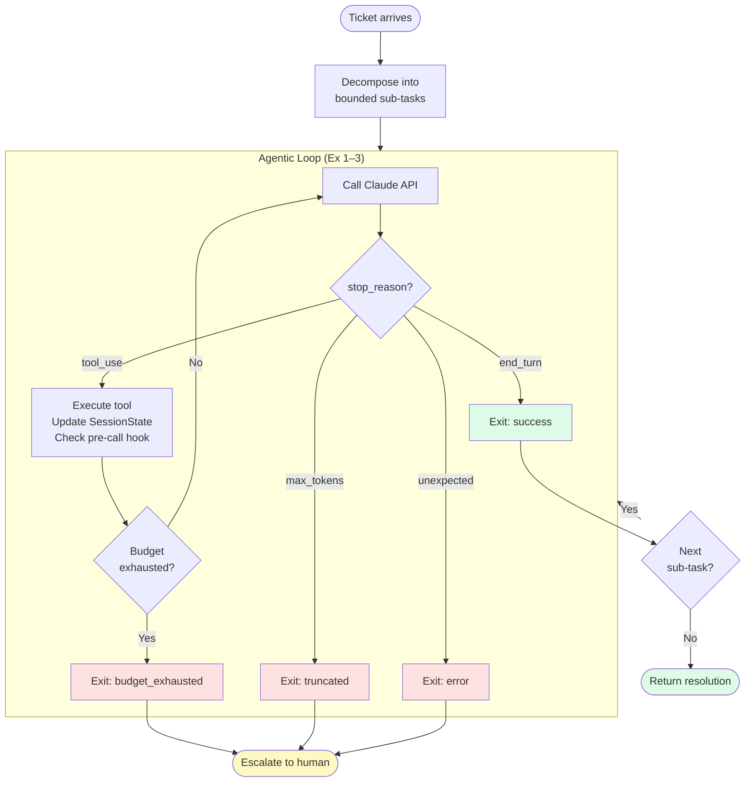
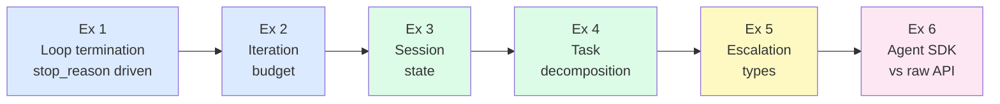
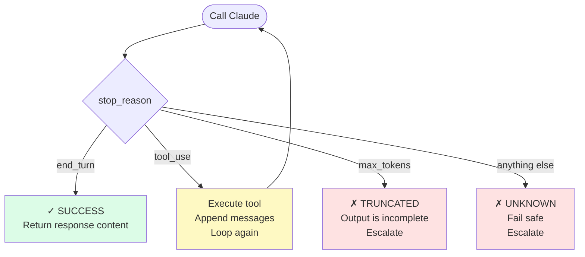
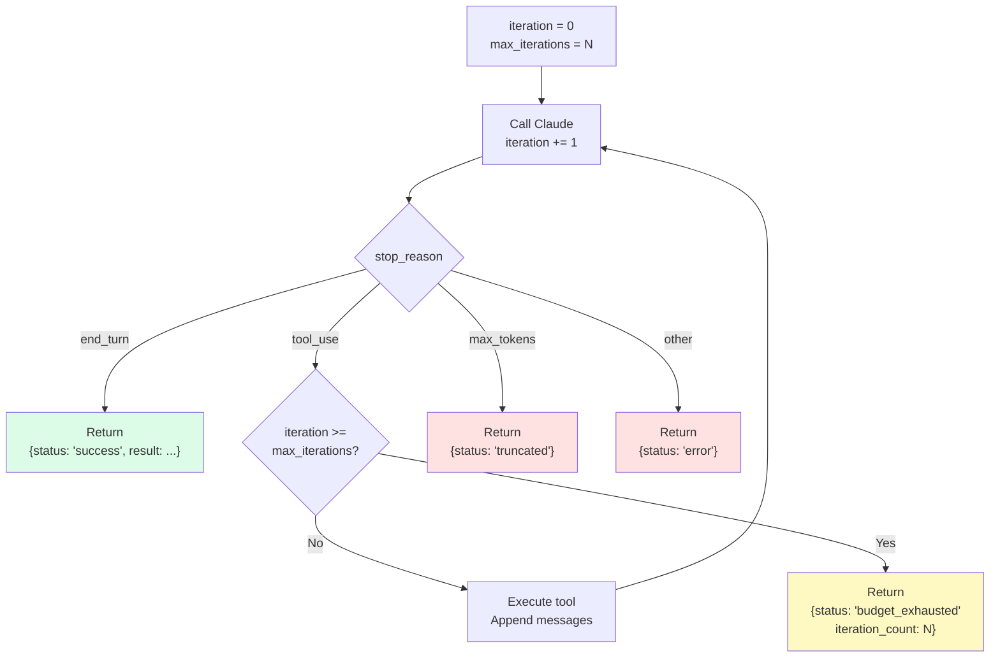
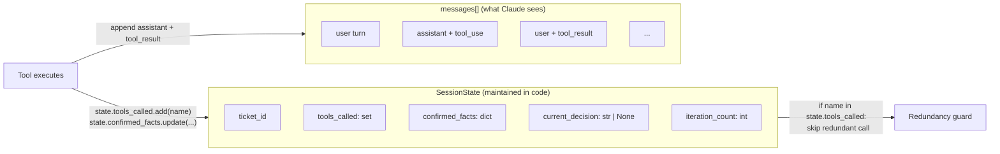
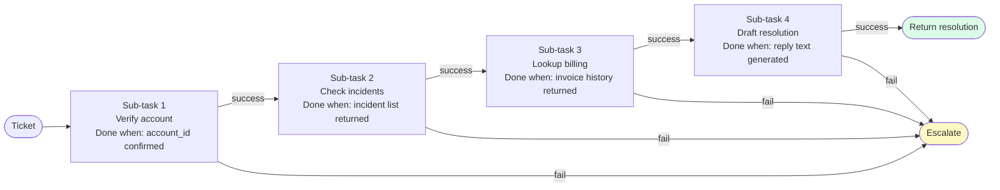
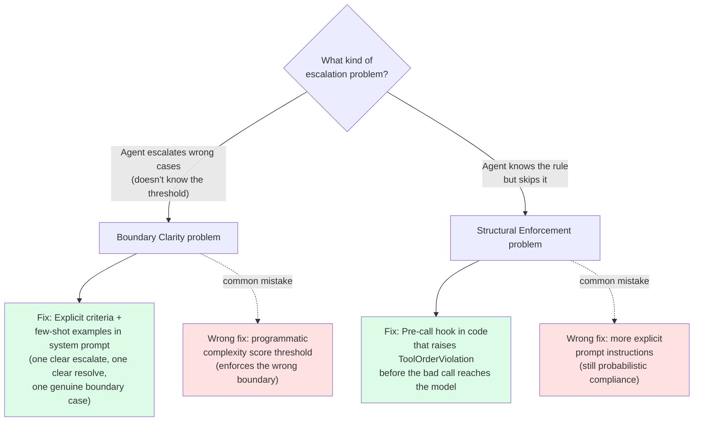
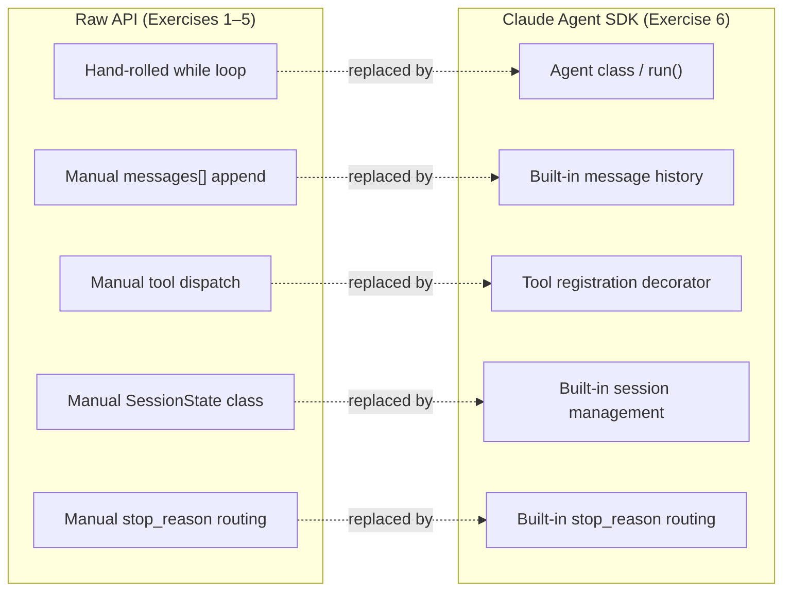

# Week 2 Lab — Agentic Architecture (Part 1)

> **Resolve context:** This is the week that explains the $11,400 incident. The agent that ran 14,000 tool calls on a single ticket was not broken — it was doing exactly what it was designed to do. The design was the problem. These exercises rebuild that agent from first principles, replacing every fragile assumption with a deterministic guarantee.

---

## How It All Fits Together

The complete architecture you build across these six exercises:



**Core idea:** Every exit from the loop is typed. The calling code acts on the exit reason — it never assumes success.

---

## Exercise Progression



---

## Learning Objectives

- Control agentic loop termination exclusively through `stop_reason` — never through model language
- Implement a robust iteration budget and understand why it is non-negotiable
- Model session state as an explicit data structure, not as implicit conversation history
- Decompose complex tasks into bounded sub-tasks with defined completion criteria
- Handle every possible `stop_reason` value explicitly, including unexpected ones
- Understand what the Claude Agent SDK provides on top of the raw API — and when to use each

## Prerequisites

- Week 1 lab completed — you must understand `stop_reason`, `tool_use`, and the tool call message cycle
- Anthropic SDK installed (`pip install anthropic` / `npm install @anthropic-ai/sdk`)
- `.env` with `ANTHROPIC_API_KEY`

**Languages:** Each exercise is implemented in both Python (`exercise_N.py`) and TypeScript (`exercise_N.ts`).

> **Agent SDK note:** Exam Scenarios 1, 3, and 4 explicitly reference the **Claude Agent SDK**, not the raw `anthropic` client. The SDK provides higher-level abstractions for session management, tool registration, and agent loops. Exercise 6 this week introduces the SDK. Raw API exercises (1–5) remain essential because the exam tests both layers.

---

## Exercises

### Exercise 1 — The Loop That Terminates Correctly

**Goal:** Build an agentic loop that handles all four `stop_reason` values explicitly and never exits on an unrecognised state.



**The bug the broken version has:** An `else` or natural-language check that treats unknown/truncated responses as success.

**Scenario:** Reproduce a simplified version of the loop that caused the Chapter 1 incident. First build the broken version that exits on natural language detection. Then replace it with `stop_reason`-driven termination.

**You will:**
1. Write a loop that calls the API, checks `stop_reason`, and routes each value to a specific handler
2. Handle `end_turn` (success), `tool_use` (continue), `max_tokens` (truncation — escalate), and any unexpected value (fail safe — escalate)
3. Demonstrate that removing the natural language check has zero impact on correct operation
4. Deliberately trigger each `stop_reason` by crafting inputs that produce them

**Key insight:** There is no fifth `stop_reason`. If your loop has an `else` branch that treats unexpected values as success, you have a silent failure path.

---

### Exercise 2 — The Iteration Budget

**Goal:** Implement a principled iteration budget that distinguishes between "the task is done," "the task hit its limit," and "the task failed."



**Return typed results, not strings.** The caller must be able to branch on `status` — not parse a message.

**Scenario:** The Chapter 1 agent had no iteration budget. The rate limiter was the only thing that stopped it — after 14,000 calls. This exercise makes the budget explicit and shows what happens at each boundary.

**You will:**
1. Add an `iteration_count` and `max_iterations` to the loop from Exercise 1
2. Implement three distinct exit paths: normal completion, budget exhausted, and error
3. Return a typed result object from the loop — not a string — so callers can act on the exit reason
4. Run the agent on a ticket designed to require exactly 1, 3, and 7 tool calls — verify the budget fires correctly in the third case
5. Log each iteration: which tools were called, what they returned, and what the `stop_reason` was

**Key insight:** A loop that exits with `{"status": "budget_exhausted"}` is not a failure — it is a correct escalation. A loop that exits with `{"status": "success"}` after running out of iterations is a lie.

---

### Exercise 3 — Modelling Session State

**Goal:** Represent the agent's working state as an explicit data structure rather than relying on conversation history alone.



**Key distinction:** History tells you *what was said*. State tells you *what was established*. Use state for decisions, history for context.

**Scenario:** Resolve's agents handle tickets that span multiple API calls. Between calls, the agent must track which tools it has already called, what it has already confirmed, and what decisions it has already made. Losing this state causes the contradictions described in Chapter 5.

**You will:**
1. Define a `SessionState` dataclass (Python) or interface (TypeScript) with fields: `ticket_id`, `tools_called`, `confirmed_facts`, `current_decision`, `iteration_count`
2. Update the state object after every tool call — before passing results back to the model
3. Use the state to prevent redundant tool calls (if `get_account_status` was already called this session, do not call it again)
4. Serialize the state to JSON at the end of each session for audit purposes

**Key insight:** Conversation history tells you *what was said*. Session state tells you *what was established*. The exam tests whether you know the difference.

---

### Exercise 4 — Task Decomposition

**Goal:** Break a multi-step ticket resolution into a sequence of bounded sub-tasks, each with a defined completion criterion.



**Completion criteria live in code — not in the model.** The model produces output; your code decides if the sub-task is done.

**Scenario:** A Resolve enterprise ticket requires: (1) verifying account status, (2) checking for known incidents, (3) looking up billing history, and (4) drafting a resolution. Treating this as one open-ended task is what caused the Chapter 1 loop — the model kept deciding it needed "more context."

**You will:**
1. Define each sub-task as a function with a typed signature: `input → result | escalation`
2. Chain the sub-tasks sequentially — the output of each becomes the input of the next
3. Implement a completion criterion for each sub-task evaluated by the code, not the model
4. Verify that if sub-task 2 fails, sub-tasks 3 and 4 do not run — the chain short-circuits to escalation

**Key insight:** An agent given a bounded task with defined completion criteria will terminate. An agent given an open-ended task will explore until it hits a budget — or, without a budget, indefinitely.

---

### Exercise 5 — Escalation: Boundary Clarity vs. Structural Enforcement



**Exam rule:** Sentiment analysis, confidence scores, and separate classifiers are all wrong answers. If the boundary is unclear → fix the prompt with examples. If the rule is known but skipped → enforce it in code.

**Goal:** Understand the two distinct escalation problems the exam tests — and apply the correct fix to each. Conflating them is one of the most common ways to lose marks on Scenario 1 questions.

**The distinction the exam makes:**

| Problem | Root cause | Correct fix |
|---|---|---|
| Agent escalates wrong cases — boundaries unclear | The agent doesn't know *what* meets the escalation threshold | Explicit criteria + few-shot examples in the system prompt |
| Agent knows the rule but skips it | Probabilistic compliance with a known rule | Programmatic hook that enforces the rule structurally |

**Scenario A — Boundary clarity problem:** Resolve's agent achieves 55% first-contact resolution. Logs show it escalates straightforward damage replacements while autonomously attempting complex policy exceptions. The agent is not ignoring a rule — it genuinely cannot distinguish the cases. This is a decision boundary problem.

**Scenario B — Structural enforcement problem:** Resolve's agent occasionally calls `process_refund` before `get_customer` has returned a verified ID, leading to misidentified refunds. The agent "knows" verification should come first (it is in the system prompt) but probabilistically skips it.

**You will:**
1. Implement the wrong fix for Scenario A: add a programmatic complexity score threshold. Run on 10 tickets. Observe that the threshold fires incorrectly because the *criteria* are still unclear — the code enforces the wrong boundary.
2. Implement the correct fix for Scenario A: add explicit escalation criteria with 3 few-shot examples (one clear escalation, one clear resolution, one genuine boundary case with reasoning). Measure improvement.
3. Implement the wrong fix for Scenario B: add more explicit instructions to the system prompt. Verify that even with strong prompt instructions, the skip occasionally recurs.
4. Implement the correct fix for Scenario B: a pre-call hook that raises a `ToolOrderViolation` if `process_refund` or `lookup_order` is called before `get_customer` has returned a verified ID this session.
5. Confirm the rule: **when the agent doesn't know what to do → fix the prompt; when the agent knows but doesn't reliably do it → fix the code.**

**Key insight:** Sentiment analysis is always wrong (it measures the wrong thing). Self-reported model confidence is always wrong (LLMs are poorly calibrated). A separate classifier is over-engineered as a first step. The exam's Scenario 1 Q3 answer is *few-shot examples with explicit criteria* — because the root cause is unclear decision boundaries, not structural non-compliance. Do not confuse the two problems.

---

### Exercise 6 — The Claude Agent SDK



**What the SDK does NOT change:** The underlying termination contract (`stop_reason`), the tool call message cycle, and escalation logic. The exam tests these invariants — the SDK is just how you express them.

**Goal:** Understand what the Agent SDK provides on top of the raw API and rebuild the Resolve loop using it — this is the layer the exam's Scenario 1, 3, and 4 questions assume you know.

**Scenario:** Jade's original agent used raw `anthropic.messages.create` calls with a hand-rolled loop. The Agent SDK provides session management, built-in tool registration, and agent lifecycle hooks as first-class primitives — reducing boilerplate and making the loop's structure explicit.

**You will:**
1. Install the Agent SDK (`pip install anthropic[agent]` / `npm install @anthropic-ai/sdk`) and understand how it differs from the base client
2. Rewrite the ticket resolution loop from Exercise 1 using the Agent SDK's `Agent` class — observe which parts of your hand-rolled loop the SDK replaces
3. Register the Resolve MCP tools (`get_customer`, `lookup_order`, `process_refund`, `escalate_to_human`) using the SDK's tool registration pattern — these are the exact tool names used in the official Scenario 1
4. Implement session management using the SDK's built-in session primitives — compare how session state is handled vs. the manual `SessionState` dataclass from Exercise 3
5. Verify that the SDK's agent loop still terminates on `stop_reason` — confirm the SDK does not change the underlying termination contract

**Key insight:** The Agent SDK does not change what the exam tests about loop termination, session state, or escalation logic — it changes how you implement them. Exam questions describe Agent SDK patterns; knowing the raw API layer is what lets you reason about *why* those patterns are correct.

---

## Lab Completion Checklist

Before moving to Week 3, answer these without looking:

- [ ] What happens if your loop's `stop_reason` handler has an `else` branch that defaults to continuing?
- [ ] What is the correct exit behaviour when `stop_reason` is `max_tokens`?
- [ ] Why is a typed result object better than a string return from an agentic loop?
- [ ] What is the difference between `iteration_count` in session state and `len(messages)` in message history?
- [ ] Give two examples of task completion criteria the code can evaluate without asking the model
- [ ] Why should sentiment-based escalation logic fail on the exam?
- [ ] Name two things the Agent SDK handles that you had to implement manually in Exercises 1–5

---

## Exam Connections

| Exercise | Domain | Exam Pattern Covered |
|---|---|---|
| 1 | D1 | `stop_reason` drives loop termination — not model language |
| 2 | D1 | Iteration budget; typed exit reasons; budget exhausted ≠ failure |
| 3 | D1, D5 | Session state as explicit structure; preventing redundant tool calls |
| 4 | D1 | Task decomposition; bounded sub-tasks; completion criteria in code |
| 5 | D1 | Escalation: complexity-based vs. sentiment-based |
| 6 | D1 | Agent SDK vs. raw API; session management; Scenario 1/3/4 tool names |

---

## What's Next

Week 3 covers the second half of Domain 1: multi-agent orchestration, the coordinator/subagent pattern, hub-and-spoke architecture, and hooks as programmatic guardrails.

→ **[Week 3 Lab — Agentic Architecture Part 2](../week-3-agentic-architecture-part2/README.md)**

---

## Running the Exercises

```bash
cd labs/week-2-agentic-architecture-part1
pip install anthropic python-dotenv
python exercise_1_loop_termination.py
python exercise_2_iteration_budget.py
python exercise_3_session_state.py
python exercise_4_task_decomposition.py
python exercise_5_escalation.py
python exercise_6_agent_sdk.py
```
