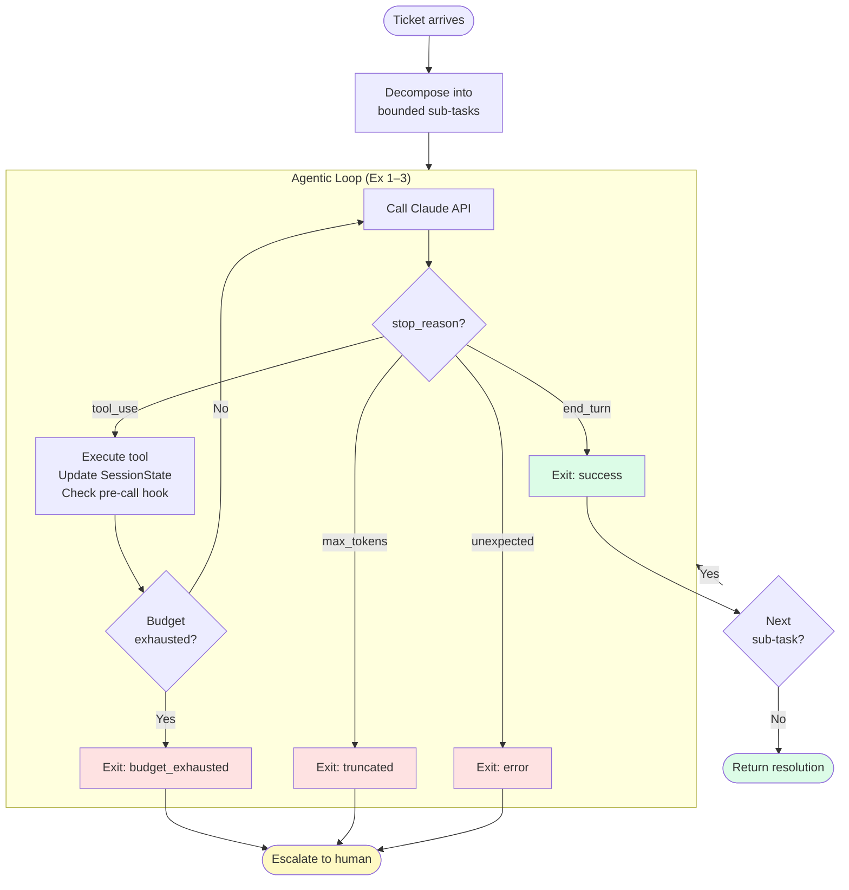
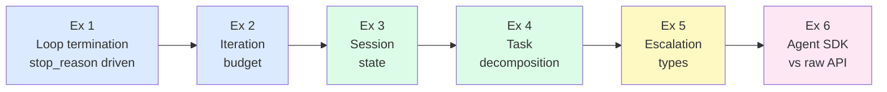
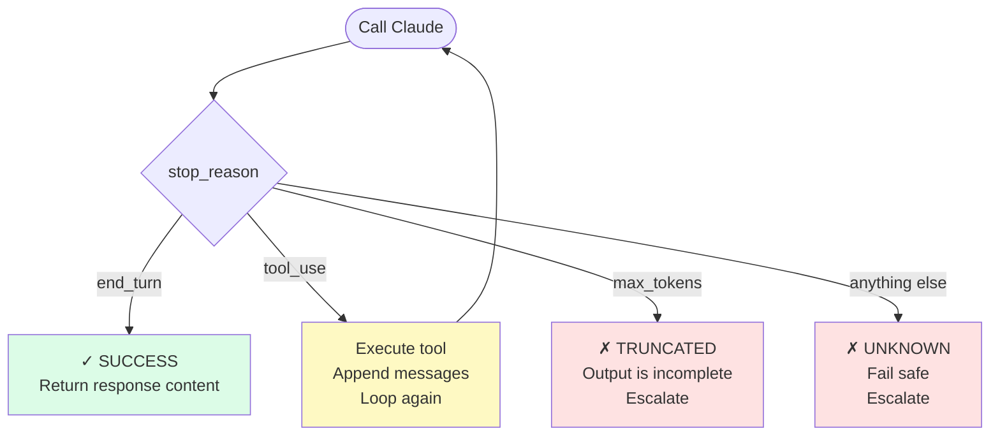
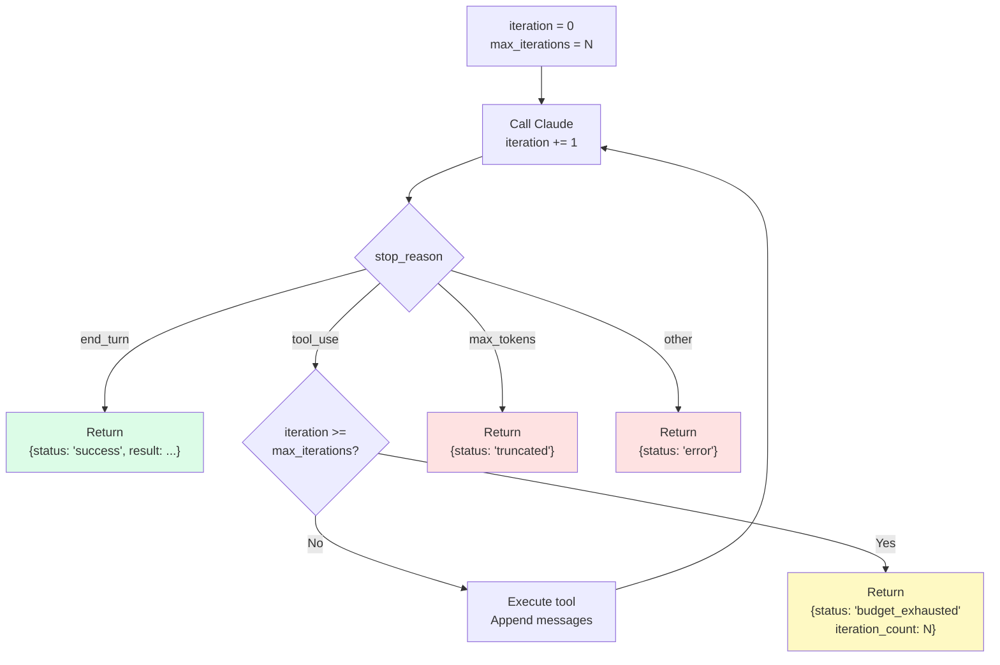
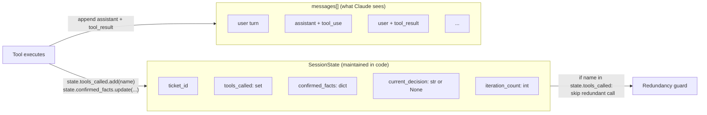
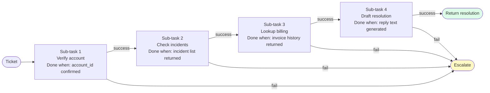
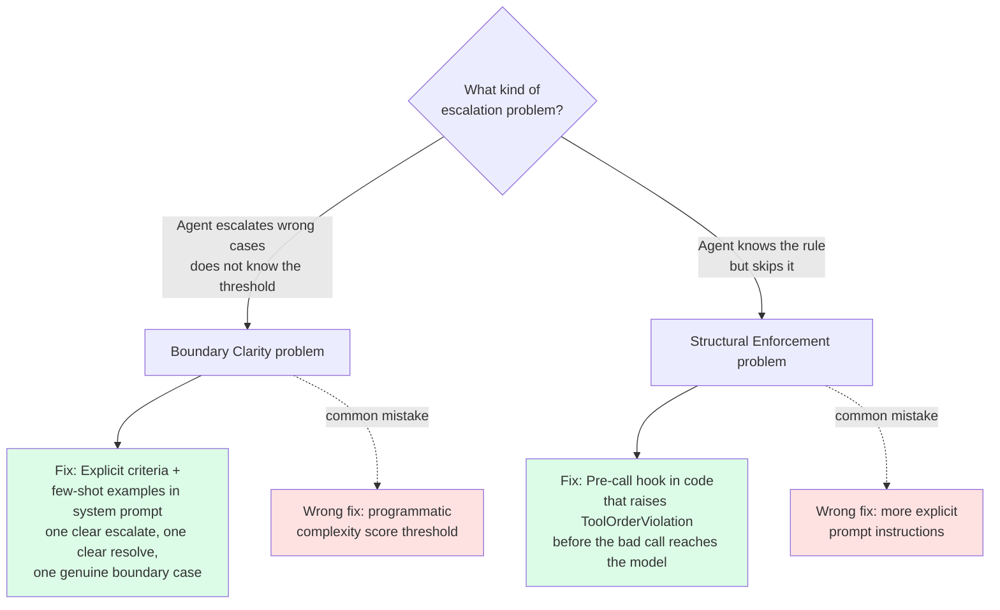
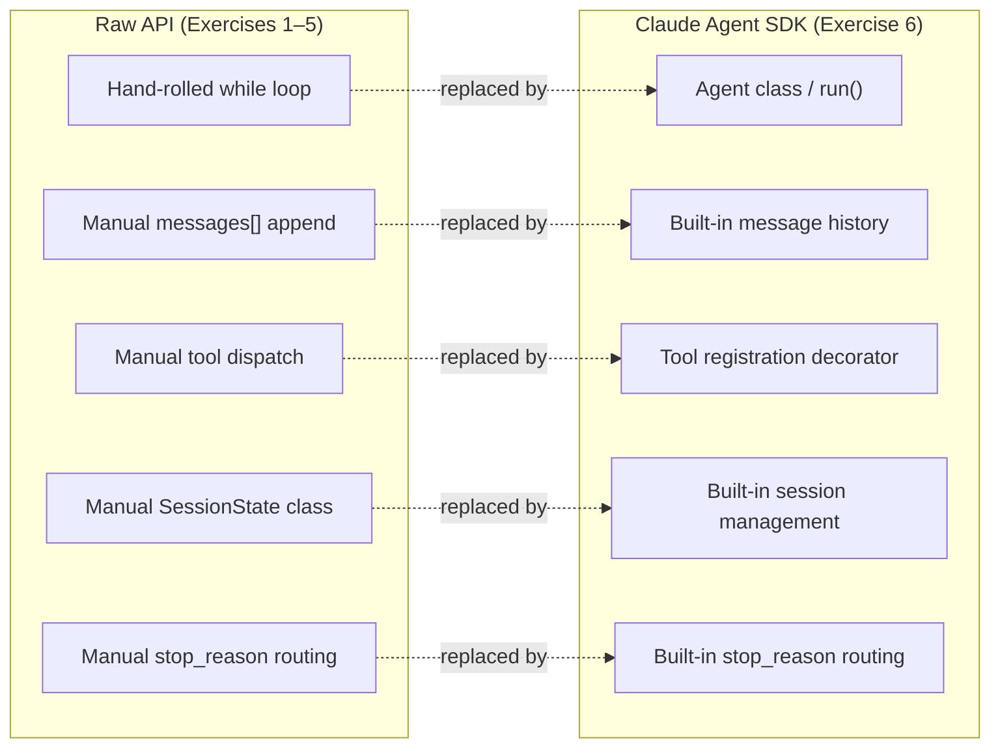

# Week 2 Lab — Agentic Architecture (Part 1)

> **Resolve context:** This is the week that explains the $11,400 incident. The agent that ran 14,000 tool calls on a single ticket was not broken — it was doing exactly what it was designed to do. The design was the problem. These exercises rebuild that agent from first principles, replacing every fragile assumption with a deterministic guarantee.

---

## How It All Fits Together

The complete architecture you build across these six exercises:


```mermaid
flowchart TD
    Ticket([Ticket arrives]) --> SD[Decompose into\nbounded sub-tasks]
    SD --> Loop

    subgraph Loop ["Agentic Loop (Ex 1–3)"]
        direction TB
        L1[Call Claude API] --> L2{stop_reason?}
        L2 -->|tool_use| L3[Execute tool\nUpdate SessionState\nCheck pre-call hook]
        L3 --> L4{Budget\nexhausted?}
        L4 -->|No| L1
        L4 -->|Yes| LE[Exit: budget_exhausted]
        L2 -->|end_turn| LS[Exit: success]
        L2 -->|max_tokens| LF[Exit: truncated]
        L2 -->|unexpected| LF2[Exit: error]
    end

    LS --> Next{Next\nsub-task?}
    Next -->|Yes| Loop
    Next -->|No| Done([Return resolution])

    LE --> Escalate([Escalate to human])
    LF --> Escalate
    LF2 --> Escalate

    style LS fill:#dcfce7
    style Done fill:#dcfce7
    style Escalate fill:#fef9c3
    style LE fill:#fee2e2
    style LF fill:#fee2e2
    style LF2 fill:#fee2e2
```

**Core idea:** Every exit from the loop is typed. The calling code acts on the exit reason — it never assumes success.

---

## Exercise Progression


```mermaid
flowchart LR
    E1[Ex 1\nLoop termination\nstop_reason driven] --> E2[Ex 2\nIteration\nbudget]
    E2 --> E3[Ex 3\nSession\nstate]
    E3 --> E4[Ex 4\nTask\ndecomposition]
    E4 --> E5[Ex 5\nEscalation\ntypes]
    E5 --> E6[Ex 6\nAgent SDK\nvs raw API]

    style E1 fill:#dbeafe
    style E2 fill:#dbeafe
    style E3 fill:#dcfce7
    style E4 fill:#dcfce7
    style E5 fill:#fef9c3
    style E6 fill:#fce7f3
```

---

## Prerequisites

- Week 1 lab completed — you must understand `stop_reason`, `tool_use`, and the tool call message cycle
- `pip install anthropic python-dotenv`
- `.env` with `ANTHROPIC_API_KEY`

> **Agent SDK note:** Exam Scenarios 1, 3, and 4 explicitly reference the **Claude Agent SDK**, not the raw `anthropic` client. Exercise 6 introduces the SDK. Exercises 1–5 use the raw API and remain essential because the exam tests both layers.

---

## Exercise 1 — The Loop That Terminates Correctly

**What it teaches:** The exact difference between a loop that exits on model language (non-deterministic) and one that exits on `stop_reason` (deterministic). This is the root cause of the $11,400 incident.


```mermaid
flowchart TD
    Start([Call Claude]) --> SR{stop_reason}

    SR -->|end_turn| A["✓ SUCCESS\nReturn response content"]
    SR -->|tool_use| B["Execute tool\nAppend messages\nLoop again"]
    SR -->|max_tokens| C["✗ TRUNCATED\nOutput is incomplete\nEscalate"]
    SR -->|anything else| D["✗ UNKNOWN\nFail safe\nEscalate"]

    B --> Start

    style A fill:#dcfce7
    style B fill:#fef9c3
    style C fill:#fee2e2
    style D fill:#fee2e2
```

The file contains two implementations side by side — the broken version and the correct version — so you can see exactly where the bug lives.

Create `exercise_1_loop_termination.py`:

```python
"""
Exercise 1 — The Loop That Terminates Correctly

Demonstrates the difference between a broken loop (natural language detection)
and a correct loop (stop_reason driven). Every stop_reason value is handled
explicitly — there is no else branch that defaults to continuing.
"""
import anthropic
from dotenv import load_dotenv

load_dotenv()
client = anthropic.Anthropic()

TOOLS = [
    {
        "name": "get_account_status",
        "description": "Retrieve account status from the CRM.",
        "input_schema": {
            "type": "object",
            "properties": {
                "customer_id": {"type": "string"}
            },
            "required": ["customer_id"]
        }
    },
    {
        "name": "lookup_invoice",
        "description": "Look up a specific invoice by ID.",
        "input_schema": {
            "type": "object",
            "properties": {
                "invoice_id": {"type": "string"}
            },
            "required": ["invoice_id"]
        }
    }
]

def execute_tool(name: str, inputs: dict) -> dict:
    """Simulated tool execution."""
    if name == "get_account_status":
        return {
            "status": "success",
            "customer_id": inputs["customer_id"],
            "plan": "enterprise",
            "open_invoices": 2,
            "account_status": "active"
        }
    if name == "lookup_invoice":
        return {
            "status": "success",
            "invoice_id": inputs["invoice_id"],
            "amount": 4200.00,
            "paid": False,
            "due_date": "2026-05-01"
        }
    return {"status": "error", "message": f"Unknown tool: {name}"}


# ── BROKEN VERSION ────────────────────────────────────────────────────────────
def broken_loop(ticket: str) -> str:
    """
    Bug: exits when model text contains 'I have enough information' or similar.
    This is non-deterministic and will silently fail when the model phrases
    its conclusion differently.
    """
    import json
    messages = [{"role": "user", "content": ticket}]

    for _ in range(10):
        response = client.messages.create(
            model="claude-sonnet-4-6",
            max_tokens=512,
            tools=TOOLS,
            messages=messages
        )

        # ✗ WRONG: checking model language instead of stop_reason
        for block in response.content:
            if hasattr(block, "text") and "enough information" in block.text.lower():
                return block.text  # exits on a phrase that may never appear

        # ✗ WRONG: the else branch treats tool_use AND max_tokens the same
        if response.stop_reason == "tool_use":
            messages.append({"role": "assistant", "content": response.content})
            tool_results = []
            for block in response.content:
                if block.type == "tool_use":
                    result = execute_tool(block.name, block.input)
                    tool_results.append({
                        "type": "tool_result",
                        "tool_use_id": block.id,
                        "content": json.dumps(result)
                    })
            messages.append({"role": "user", "content": tool_results})
        else:
            # ✗ WRONG: handles end_turn AND max_tokens AND unknown values identically
            for block in response.content:
                if hasattr(block, "text"):
                    return block.text
            return "No text response"  # silently succeeds even on truncation

    return "Loop limit reached"


# ── CORRECT VERSION ───────────────────────────────────────────────────────────
def correct_loop(ticket: str) -> dict:
    """
    Every stop_reason is handled explicitly.
    Returns a typed dict so the caller knows WHY the loop exited.
    """
    import json
    messages = [{"role": "user", "content": ticket}]

    for iteration in range(1, 11):
        print(f"  iteration {iteration}")
        response = client.messages.create(
            model="claude-sonnet-4-6",
            max_tokens=512,
            tools=TOOLS,
            messages=messages
        )

        print(f"  stop_reason: {response.stop_reason}")

        if response.stop_reason == "end_turn":
            # ✓ Model finished — output is complete
            text = next((b.text for b in response.content if hasattr(b, "text")), "")
            return {"status": "success", "reply": text, "iterations": iteration}

        elif response.stop_reason == "tool_use":
            # ✓ Execute every tool the model requested, then loop
            messages.append({"role": "assistant", "content": response.content})
            tool_results = []
            for block in response.content:
                if block.type == "tool_use":
                    print(f"  tool call: {block.name}({block.input})")
                    result = execute_tool(block.name, block.input)
                    tool_results.append({
                        "type": "tool_result",
                        "tool_use_id": block.id,
                        "content": json.dumps(result)
                    })
            messages.append({"role": "user", "content": tool_results})

        elif response.stop_reason == "max_tokens":
            # ✓ Output was cut off — never treat as success
            return {"status": "truncated", "iterations": iteration}

        else:
            # ✓ Unknown stop_reason — fail safe, never continue
            return {"status": "error", "stop_reason": response.stop_reason, "iterations": iteration}

    return {"status": "budget_exhausted", "iterations": 10}


# ── DEMO ──────────────────────────────────────────────────────────────────────
TICKET = (
    "Hi, my invoice INV-2026-0042 shows a charge of $4,200 but I thought "
    "I was on the starter plan. Customer ID is cust_9182. Can you investigate?"
)

print("=" * 60)
print("CORRECT LOOP")
print("=" * 60)
result = correct_loop(TICKET)
print(f"\nExit status : {result['status']}")
print(f"Iterations  : {result['iterations']}")
if result["status"] == "success":
    print(f"Reply       : {result['reply'][:200]}...")

print()
print("Key takeaway:")
print("  stop_reason drives termination. Model language does not.")
print("  Every branch is explicit. There is no silent success path.")
```

**What to observe:**
- Each iteration prints its `stop_reason` — watch it change from `tool_use` to `end_turn` as the loop progresses
- The correct loop returns a `dict` with a `status` field, not a raw string. The caller branches on `status`, not on parsing the reply text
- The broken loop has two silent failure paths: the phrase check (which may never trigger) and the `else` branch (which treats truncation as success)

**Questions to answer before moving on:**
1. What does the broken loop return if the model never uses the phrase "enough information"?
2. What would happen in the correct loop if `stop_reason` were `"stop_sequence"`? Which branch handles it and what does it return?
3. Why does the correct loop return `{"status": "budget_exhausted"}` after 10 iterations instead of `{"status": "success"}`?

**Try it:** Change `max_tokens=512` to `max_tokens=5` in the correct loop. Observe the `truncated` exit path fire. Then do the same in the broken loop — notice it returns the truncated text as if it were a complete answer.

**Exam trap:** The `else` branch that defaults to continuing is the most common exam distractor. Any loop that does not explicitly handle all four `stop_reason` values has a silent failure path.

---

## Exercise 2 — The Iteration Budget

**What it teaches:** How to implement a principled iteration budget that returns distinct, typed exit statuses. The exam tests whether you know the difference between `budget_exhausted` (a correct escalation) and a silent overrun.


```mermaid
flowchart TD
    Init["iteration = 0\nmax_iterations = N"] --> Loop

    Loop["Call Claude\niteration += 1"] --> SR{stop_reason}

    SR -->|end_turn| OK["Return\n{status: 'success', result: ...}"]
    SR -->|tool_use| BudgetCheck{iteration >=\nmax_iterations?}
    SR -->|max_tokens| Trunc["Return\n{status: 'truncated'}"]
    SR -->|other| Err["Return\n{status: 'error'}"]

    BudgetCheck -->|No| ExecTool["Execute tool\nAppend messages"] --> Loop
    BudgetCheck -->|Yes| Budget["Return\n{status: 'budget_exhausted'\niteration_count: N}"]

    style OK fill:#dcfce7
    style Budget fill:#fef9c3
    style Trunc fill:#fee2e2
    style Err fill:#fee2e2
```

**Return typed results, not strings.** The caller must branch on `status` — not parse a message.

Create `exercise_2_iteration_budget.py`:

```python
"""
Exercise 2 — The Iteration Budget

Implements a principled iteration budget with three distinct exit paths:
  - success          → model reached end_turn within budget
  - budget_exhausted → iteration limit hit before completion
  - truncated        → max_tokens fired (output incomplete)
  - error            → unexpected stop_reason

The exit status is a typed dataclass, not a string. The caller branches on it.
"""
import json
import logging
from dataclasses import dataclass, field
from typing import Any

import anthropic
from dotenv import load_dotenv

load_dotenv()
client = anthropic.Anthropic()

logging.basicConfig(level=logging.INFO, format="%(message)s")
log = logging.getLogger(__name__)


@dataclass
class LoopResult:
    status: str          # success | budget_exhausted | truncated | error
    reply: str = ""
    iteration_count: int = 0
    tools_called: list[dict] = field(default_factory=list)
    stop_reason: str = ""

    def __str__(self):
        base = f"status={self.status}, iterations={self.iteration_count}"
        if self.reply:
            base += f", reply_length={len(self.reply)}"
        if self.tools_called:
            names = [t["name"] for t in self.tools_called]
            base += f", tools={names}"
        return base


TOOLS = [
    {
        "name": "get_account_status",
        "description": "Get account and billing status from CRM.",
        "input_schema": {
            "type": "object",
            "properties": {"customer_id": {"type": "string"}},
            "required": ["customer_id"]
        }
    },
    {
        "name": "list_invoices",
        "description": "List all invoices for a customer.",
        "input_schema": {
            "type": "object",
            "properties": {"customer_id": {"type": "string"}},
            "required": ["customer_id"]
        }
    },
    {
        "name": "get_invoice_detail",
        "description": "Get full detail of a specific invoice.",
        "input_schema": {
            "type": "object",
            "properties": {"invoice_id": {"type": "string"}},
            "required": ["invoice_id"]
        }
    },
    {
        "name": "check_known_incidents",
        "description": "Check if there are any known billing system incidents.",
        "input_schema": {
            "type": "object",
            "properties": {},
            "required": []
        }
    }
]

def execute_tool(name: str, inputs: dict) -> dict:
    if name == "get_account_status":
        return {"status": "success", "plan": "enterprise", "open_invoices": 3}
    if name == "list_invoices":
        return {"status": "success", "invoices": ["INV-001", "INV-002", "INV-003"]}
    if name == "get_invoice_detail":
        iid = inputs.get("invoice_id", "INV-001")
        return {"status": "success", "invoice_id": iid, "amount": 1400.00, "paid": False}
    if name == "check_known_incidents":
        return {"status": "success", "active_incidents": []}
    return {"status": "error", "message": f"Unknown tool: {name}"}


def run_agent(ticket: str, max_iterations: int = 5) -> LoopResult:
    """
    Agentic loop with explicit iteration budget.
    Returns a LoopResult — never raises on expected failure modes.
    """
    messages: list[dict[str, Any]] = [{"role": "user", "content": ticket}]
    tools_called: list[dict] = []

    for iteration in range(1, max_iterations + 1):
        log.info(f"  [iter {iteration}/{max_iterations}]")

        response = client.messages.create(
            model="claude-sonnet-4-6",
            max_tokens=512,
            tools=TOOLS,
            system=(
                "You are a Resolve support agent. "
                "Always verify account status and invoice details before responding to billing questions. "
                "Check for known incidents if the customer reports unexpected charges."
            ),
            messages=messages
        )

        log.info(f"  stop_reason: {response.stop_reason}")

        if response.stop_reason == "end_turn":
            text = next((b.text for b in response.content if hasattr(b, "text")), "")
            return LoopResult(
                status="success",
                reply=text,
                iteration_count=iteration,
                tools_called=tools_called,
                stop_reason="end_turn"
            )

        elif response.stop_reason == "tool_use":
            messages.append({"role": "assistant", "content": response.content})
            tool_results = []

            for block in response.content:
                if block.type == "tool_use":
                    log.info(f"  tool: {block.name}({block.input})")
                    result = execute_tool(block.name, block.input)
                    log.info(f"  result: {result}")
                    tools_called.append({"name": block.name, "input": block.input})
                    tool_results.append({
                        "type": "tool_result",
                        "tool_use_id": block.id,
                        "content": json.dumps(result)
                    })

            messages.append({"role": "user", "content": tool_results})

            # Budget check after tool execution — not before
            if iteration == max_iterations:
                return LoopResult(
                    status="budget_exhausted",
                    iteration_count=iteration,
                    tools_called=tools_called,
                    stop_reason="tool_use"
                )

        elif response.stop_reason == "max_tokens":
            return LoopResult(
                status="truncated",
                iteration_count=iteration,
                tools_called=tools_called,
                stop_reason="max_tokens"
            )

        else:
            return LoopResult(
                status="error",
                iteration_count=iteration,
                tools_called=tools_called,
                stop_reason=response.stop_reason
            )

    return LoopResult(status="budget_exhausted", iteration_count=max_iterations)


# ── DEMO ──────────────────────────────────────────────────────────────────────
scenarios = [
    {
        "label": "Simple question (expect 1 tool call)",
        "ticket": "What plan am I on? Customer ID: cust_0001.",
        "max_iterations": 5
    },
    {
        "label": "Billing dispute (expect ~3 tool calls)",
        "ticket": (
            "I was charged $4,200 last month but my plan is starter. "
            "My customer ID is cust_9182. Invoice INV-001 looks wrong."
        ),
        "max_iterations": 5
    },
    {
        "label": "Tight budget — forces budget_exhausted",
        "ticket": (
            "I was charged $4,200 last month but my plan is starter. "
            "Customer ID cust_9182. Please check my account, all invoices, "
            "invoice detail, and any known incidents."
        ),
        "max_iterations": 2   # deliberately too low
    }
]

for s in scenarios:
    print(f"\n{'='*60}")
    print(f"Scenario : {s['label']}")
    print(f"Budget   : {s['max_iterations']} iterations")
    result = run_agent(s["ticket"], max_iterations=s["max_iterations"])
    print(f"\nResult   : {result}")
    if result.status == "success":
        print(f"Reply    : {result.reply[:150]}...")
    elif result.status == "budget_exhausted":
        print("Action   : escalate to human — loop hit budget before completing")
    elif result.status == "truncated":
        print("Action   : escalate — output was cut short, do not present as answer")
```

**What to observe:**
- Scenario 1 finishes in 1–2 iterations. `LoopResult.status` is `"success"`.
- Scenario 2 makes 2–3 tool calls (`get_account_status`, `list_invoices`, possibly `get_invoice_detail`) before reaching `end_turn`.
- Scenario 3 hits `max_iterations=2` while still in `tool_use`. The budget fires and returns `status="budget_exhausted"` — not success. The log shows which tools were called before the budget ran out.
- Notice `LoopResult` is a dataclass, not a string. The `Action` lines at the bottom show the caller branching on `status` — this is what makes the exit reason actionable.

**Questions to answer before moving on:**
1. The budget check happens *after* tool execution. Why? What would happen if it fired *before* executing the tool?
2. `budget_exhausted` is printed with "escalate to human" — it is not a crash. What is the correct action when a loop exhausts its budget?
3. Why does the simple question (Scenario 1) use fewer iterations than the billing dispute (Scenario 2)?

**Try it:** Change `max_iterations=2` in Scenario 3 to `max_iterations=1`. Observe that the budget fires on the very first tool call, before the model has established any facts. Then raise it to `max_iterations=10`. Observe that the loop completes normally, demonstrating the budget is a ceiling, not a target.

**Exam rule:** A loop that exits with `{"status": "budget_exhausted"}` is a correct escalation. A loop that exits with `{"status": "success"}` after running out of iterations is a lie. The exam distinguishes these.

---

## Exercise 3 — Modelling Session State

**What it teaches:** Why conversation history alone is insufficient for an agentic loop. Session state is what the agent has *established* — history is only what was *said*. This distinction appears directly in Domain 1 and Domain 5 questions.


```mermaid
flowchart LR
    subgraph State ["SessionState (maintained in code)"]
        S1["ticket_id"]
        S2["tools_called: set"]
        S3["confirmed_facts: dict"]
        S4["current_decision: str or None"]
        S5["iteration_count: int"]
    end

    subgraph History ["messages[] (what Claude sees)"]
        H1["user turn"]
        H2["assistant + tool_use"]
        H3["user + tool_result"]
        H4["..."]
    end

    ToolCall["Tool executes"] -->|"state.tools_called.add(name)\nstate.confirmed_facts.update(...)"| State
    ToolCall -->|"append assistant + tool_result"| History

    State -->|"if name in state.tools_called:\n  skip redundant call"| Guard["Redundancy guard"]
```

**Key distinction:** History tells you *what was said*. State tells you *what was established*. Use state for decisions, history for context.

Create `exercise_3_session_state.py`:

```python
"""
Exercise 3 — Modelling Session State

Session state is an explicit data structure maintained in code alongside the
messages array. It tracks what has been established — not just what was said.

Key behaviours demonstrated:
  - Redundant tool calls are blocked using state.tools_called
  - Confirmed facts persist across the loop and are returned in the audit log
  - State is serialised to JSON at the end of each session
"""
import json
from dataclasses import dataclass, field
from typing import Any, Optional

import anthropic
from dotenv import load_dotenv

load_dotenv()
client = anthropic.Anthropic()


@dataclass
class SessionState:
    ticket_id: str
    tools_called: set = field(default_factory=set)        # names of tools already executed
    confirmed_facts: dict = field(default_factory=dict)   # key facts extracted from tool results
    current_decision: Optional[str] = None                 # latest routing decision
    iteration_count: int = 0

    def record_tool(self, name: str, result: dict):
        self.tools_called.add(name)
        # Extract salient facts by tool name
        if name == "get_account_status" and result.get("status") == "success":
            self.confirmed_facts["plan"] = result.get("plan")
            self.confirmed_facts["open_invoices"] = result.get("open_invoices")
            self.confirmed_facts["account_verified"] = True
        elif name == "lookup_invoice" and result.get("status") == "success":
            self.confirmed_facts[f"invoice_{result['invoice_id']}"] = {
                "amount": result.get("amount"),
                "paid": result.get("paid")
            }
        elif name == "check_known_incidents":
            self.confirmed_facts["incidents_checked"] = True
            self.confirmed_facts["active_incidents"] = result.get("active_incidents", [])

    def to_dict(self) -> dict:
        return {
            "ticket_id": self.ticket_id,
            "tools_called": sorted(self.tools_called),
            "confirmed_facts": self.confirmed_facts,
            "current_decision": self.current_decision,
            "iteration_count": self.iteration_count
        }


TOOLS = [
    {
        "name": "get_account_status",
        "description": "Get account status. Call once per session — result is cached in state.",
        "input_schema": {
            "type": "object",
            "properties": {"customer_id": {"type": "string"}},
            "required": ["customer_id"]
        }
    },
    {
        "name": "lookup_invoice",
        "description": "Look up a specific invoice by ID.",
        "input_schema": {
            "type": "object",
            "properties": {"invoice_id": {"type": "string"}},
            "required": ["invoice_id"]
        }
    },
    {
        "name": "check_known_incidents",
        "description": "Check for active billing incidents. Call once per session.",
        "input_schema": {
            "type": "object",
            "properties": {},
            "required": []
        }
    }
]


def execute_tool(name: str, inputs: dict, state: SessionState) -> dict:
    """
    Execute a tool, guarding against redundant calls for idempotent lookups.
    Returns a cached-result notice if the tool was already called this session.
    """
    # Guard: block redundant calls for tools that should only run once
    if name in ("get_account_status", "check_known_incidents") and name in state.tools_called:
        print(f"  [guard] {name} already called this session — returning cached facts")
        return {
            "status": "cached",
            "message": f"{name} was already called this session. Use the confirmed facts.",
            "confirmed_facts": state.confirmed_facts
        }

    print(f"  [tool]  {name}({inputs})")

    if name == "get_account_status":
        return {"status": "success", "plan": "enterprise", "open_invoices": 2}
    if name == "lookup_invoice":
        return {
            "status": "success",
            "invoice_id": inputs.get("invoice_id", "INV-001"),
            "amount": 4200.00,
            "paid": False,
            "due_date": "2026-05-01"
        }
    if name == "check_known_incidents":
        return {"status": "success", "active_incidents": []}
    return {"status": "error", "message": f"Unknown tool: {name}"}


def run_session(ticket_id: str, ticket_text: str, max_iterations: int = 8) -> dict:
    state = SessionState(ticket_id=ticket_id)
    messages: list[dict[str, Any]] = [{"role": "user", "content": ticket_text}]

    print(f"\n{'='*60}")
    print(f"Ticket {ticket_id}: {ticket_text[:80]}...")

    for _ in range(max_iterations):
        state.iteration_count += 1
        response = client.messages.create(
            model="claude-sonnet-4-6",
            max_tokens=512,
            tools=TOOLS,
            system=(
                "You are a Resolve support agent. "
                "Check account status and incidents before responding to billing questions. "
                "Do not call the same lookup tool twice."
            ),
            messages=messages
        )

        if response.stop_reason == "end_turn":
            text = next((b.text for b in response.content if hasattr(b, "text")), "")
            state.current_decision = "resolved"
            break

        elif response.stop_reason == "tool_use":
            messages.append({"role": "assistant", "content": response.content})
            tool_results = []
            for block in response.content:
                if block.type == "tool_use":
                    result = execute_tool(block.name, block.input, state)
                    state.record_tool(block.name, result)  # update state BEFORE next call
                    tool_results.append({
                        "type": "tool_result",
                        "tool_use_id": block.id,
                        "content": json.dumps(result)
                    })
            messages.append({"role": "user", "content": tool_results})

        else:
            state.current_decision = "escalated"
            break
    else:
        state.current_decision = "budget_exhausted"

    audit = state.to_dict()
    print(f"\nSession audit log:")
    print(json.dumps(audit, indent=2))
    return audit


# ── DEMO ──────────────────────────────────────────────────────────────────────
# This ticket is designed to make the model want to call get_account_status twice.
# The state guard will intercept the second call.
run_session(
    ticket_id="TKT-0042",
    ticket_text=(
        "Hi, I have an issue with invoice INV-0042. My account balance seems wrong. "
        "Can you check my account status and then look at the invoice? "
        "Also double-check my account status one more time to be sure. "
        "Customer ID is cust_9182."
    )
)

print("\nKey takeaway:")
print("  state.tools_called prevents duplicate CRM calls in the same session.")
print("  confirmed_facts accumulates verified data across all iterations.")
print("  The audit log is serialisable — ready for compliance storage.")
```

**What to observe:**
- The ticket explicitly asks for `get_account_status` twice. Watch the `[guard]` line fire on the second attempt — the second call never reaches the simulated CRM.
- The audit log at the end shows `tools_called` as a sorted list and `confirmed_facts` as a populated dict. This is the audit trail.
- `state.record_tool()` is called *before* the tool result is added back to `messages`. This ensures the state is current before the model's next turn begins.
- `iteration_count` in the state is a reliable counter. `len(messages)` in the history would give a different (larger) number because each tool call adds two messages.

**Questions to answer before moving on:**
1. Why is `state.record_tool()` called before `messages.append()`? What could go wrong if the order were reversed?
2. `confirmed_facts` is keyed by fact name (`"plan"`, `"open_invoices"`), not by tool name. Why is this a better structure for decisions?
3. The state guard returns a `"cached"` status dict. How does the model interpret this response? Does it still know the account plan?

**Try it:** Remove the redundancy guard (the `if name in state.tools_called` check) and run again. Observe the model calling `get_account_status` twice. Then restore the guard and observe the `[guard]` line intercept the second call. This is the CRM call cost that the guard eliminates in production.

**Exam rule:** Session state and conversation history are not the same. State is deterministic and code-controlled. History is what the model sees — it can grow large, can be truncated, and can contain inconsistencies if the model changes its mind. Always make decisions from state, not from parsing history.

---

## Exercise 4 — Task Decomposition

**What it teaches:** How to break a multi-step ticket into bounded sub-tasks, each with a completion criterion evaluated in code. This is the architectural fix for the Chapter 1 incident — an agent given a bounded task terminates; an agent given an open-ended task explores indefinitely.


```mermaid
flowchart LR
    T([Ticket]) --> ST1

    ST1["Sub-task 1\nVerify account\nDone when: account_id confirmed"] -->|success| ST2
    ST1 -->|fail| ESC([Escalate])

    ST2["Sub-task 2\nCheck incidents\nDone when: incident list returned"] -->|success| ST3
    ST2 -->|fail| ESC

    ST3["Sub-task 3\nLookup billing\nDone when: invoice history returned"] -->|success| ST4
    ST3 -->|fail| ESC

    ST4["Sub-task 4\nDraft resolution\nDone when: reply text generated"] -->|success| Done([Return resolution])
    ST4 -->|fail| ESC

    style Done fill:#dcfce7
    style ESC fill:#fef9c3
```

**Completion criteria live in code — not in the model.** The model produces output; your code decides if the sub-task is done.

Create `exercise_4_task_decomposition.py`:

```python
"""
Exercise 4 — Task Decomposition

Breaks a complex ticket into four bounded sub-tasks, each with a completion
criterion evaluated in code — not by asking the model.

Sub-task chain:
  1. verify_account    → confirms account_id + plan
  2. check_incidents   → returns incident list (may be empty)
  3. lookup_billing    → returns invoice history
  4. draft_resolution  → produces the reply text

If any sub-task fails, the chain short-circuits to escalation.
Sub-tasks 3 and 4 do not run if sub-task 2 fails.
"""
import json
from dataclasses import dataclass
from typing import Any

import anthropic
from dotenv import load_dotenv

load_dotenv()
client = anthropic.Anthropic()


@dataclass
class SubTaskResult:
    name: str
    status: str          # success | failed | escalated
    output: dict
    iterations: int


def run_subtask(
    name: str,
    system: str,
    user_message: str,
    tools: list[dict],
    tool_fn,
    completion_check,   # callable(output: dict) -> bool
    max_iterations: int = 4
) -> SubTaskResult:
    """
    Generic sub-task runner. Terminates when:
      - completion_check(output) is True
      - stop_reason is end_turn
      - budget is exhausted (→ escalated)
    """
    messages: list[dict[str, Any]] = [{"role": "user", "content": user_message}]
    output: dict = {}

    for iteration in range(1, max_iterations + 1):
        response = client.messages.create(
            model="claude-sonnet-4-6",
            max_tokens=256,
            tools=tools,
            system=system,
            messages=messages
        )

        if response.stop_reason == "end_turn":
            text = next((b.text for b in response.content if hasattr(b, "text")), "")
            output["text"] = text
            if completion_check(output):
                return SubTaskResult(name=name, status="success", output=output, iterations=iteration)
            return SubTaskResult(name=name, status="failed", output=output, iterations=iteration)

        elif response.stop_reason == "tool_use":
            messages.append({"role": "assistant", "content": response.content})
            tool_results = []
            for block in response.content:
                if block.type == "tool_use":
                    result = tool_fn(block.name, block.input)
                    output.update(result)  # accumulate tool output
                    tool_results.append({
                        "type": "tool_result",
                        "tool_use_id": block.id,
                        "content": json.dumps(result)
                    })
            messages.append({"role": "user", "content": tool_results})

        else:
            return SubTaskResult(name=name, status="failed", output=output, iterations=iteration)

    return SubTaskResult(name=name, status="escalated", output=output, iterations=max_iterations)


# ── SUB-TASK TOOL HANDLERS ────────────────────────────────────────────────────

def tool_verify_account(name: str, inputs: dict) -> dict:
    if name == "get_account_status":
        return {
            "status": "success",
            "customer_id": inputs.get("customer_id"),
            "plan": "enterprise",
            "account_status": "active"
        }
    return {"status": "error"}

def tool_check_incidents(name: str, inputs: dict) -> dict:
    if name == "check_known_incidents":
        return {"status": "success", "active_incidents": []}
    return {"status": "error"}

def tool_lookup_billing(name: str, inputs: dict) -> dict:
    if name == "list_invoices":
        return {"status": "success", "invoices": ["INV-001", "INV-002"]}
    if name == "get_invoice_detail":
        return {
            "status": "success",
            "invoice_id": inputs.get("invoice_id"),
            "amount": 4200.00,
            "paid": False
        }
    return {"status": "error"}


def run_ticket(customer_id: str, ticket_text: str):
    print(f"\n{'='*60}")
    print(f"Ticket: {ticket_text[:80]}")
    print(f"Customer: {customer_id}")

    results: list[SubTaskResult] = []

    # ── Sub-task 1: Verify account ────────────────────────────────────────────
    print("\n[Sub-task 1] verify_account")
    r1 = run_subtask(
        name="verify_account",
        system="Your only job is to call get_account_status for the customer and confirm their plan.",
        user_message=f"Verify account for customer ID {customer_id}.",
        tools=[{
            "name": "get_account_status",
            "description": "Get account status from CRM.",
            "input_schema": {
                "type": "object",
                "properties": {"customer_id": {"type": "string"}},
                "required": ["customer_id"]
            }
        }],
        tool_fn=tool_verify_account,
        # Completion criterion: status and plan must be present in output
        completion_check=lambda o: o.get("status") == "success" and "plan" in o
    )
    results.append(r1)
    print(f"  status={r1.status}, output={r1.output}")

    if r1.status != "success":
        print("\n✗ Sub-task 1 failed — escalating. Sub-tasks 2–4 will NOT run.")
        return {"status": "escalated", "failed_at": "verify_account", "results": results}

    # ── Sub-task 2: Check incidents ───────────────────────────────────────────
    print("\n[Sub-task 2] check_incidents")
    r2 = run_subtask(
        name="check_incidents",
        system="Your only job is to check for known billing incidents.",
        user_message="Are there any active billing incidents right now?",
        tools=[{
            "name": "check_known_incidents",
            "description": "Returns list of active billing incidents.",
            "input_schema": {"type": "object", "properties": {}, "required": []}
        }],
        tool_fn=tool_check_incidents,
        completion_check=lambda o: "active_incidents" in o
    )
    results.append(r2)
    print(f"  status={r2.status}, incidents={r2.output.get('active_incidents', [])}")

    if r2.status != "success":
        print("\n✗ Sub-task 2 failed — escalating. Sub-tasks 3–4 will NOT run.")
        return {"status": "escalated", "failed_at": "check_incidents", "results": results}

    # ── Sub-task 3: Lookup billing ────────────────────────────────────────────
    print("\n[Sub-task 3] lookup_billing")
    r3 = run_subtask(
        name="lookup_billing",
        system="Your only job is to retrieve the customer's invoice list.",
        user_message=f"List all invoices for customer ID {customer_id}.",
        tools=[{
            "name": "list_invoices",
            "description": "List all invoices for a customer.",
            "input_schema": {
                "type": "object",
                "properties": {"customer_id": {"type": "string"}},
                "required": ["customer_id"]
            }
        }],
        tool_fn=tool_lookup_billing,
        completion_check=lambda o: "invoices" in o
    )
    results.append(r3)
    print(f"  status={r3.status}, invoices={r3.output.get('invoices', [])}")

    if r3.status != "success":
        print("\n✗ Sub-task 3 failed — escalating. Sub-task 4 will NOT run.")
        return {"status": "escalated", "failed_at": "lookup_billing", "results": results}

    # ── Sub-task 4: Draft resolution ──────────────────────────────────────────
    print("\n[Sub-task 4] draft_resolution")
    context = (
        f"Account plan: {r1.output.get('plan')}\n"
        f"Active incidents: {r2.output.get('active_incidents')}\n"
        f"Invoices: {r3.output.get('invoices')}\n"
        f"Original ticket: {ticket_text}"
    )
    r4 = run_subtask(
        name="draft_resolution",
        system="Draft a concise, accurate reply to the customer based on the verified facts provided.",
        user_message=context,
        tools=[],  # no tools needed — this sub-task only generates text
        tool_fn=lambda n, i: {},
        completion_check=lambda o: bool(o.get("text", "").strip())
    )
    results.append(r4)
    print(f"  status={r4.status}")

    if r4.status == "success":
        print(f"\n✓ Resolution drafted:\n{r4.output.get('text', '')[:300]}")
        return {"status": "success", "reply": r4.output.get("text"), "results": results}

    return {"status": "escalated", "failed_at": "draft_resolution", "results": results}


# ── DEMO ──────────────────────────────────────────────────────────────────────
run_ticket(
    customer_id="cust_9182",
    ticket_text=(
        "I was charged $4,200 this month but I'm on the enterprise plan. "
        "Invoice INV-001 looks wrong. Can you investigate?"
    )
)

print("\nKey takeaway:")
print("  Completion criteria are evaluated in code — not by the model.")
print("  Sub-task failure short-circuits the chain immediately.")
print("  Each sub-task has a single, bounded responsibility.")
```

**What to observe:**
- Each sub-task prints its status before the next one starts. The chain is sequential and gated.
- Sub-task 4 receives no tools — it only generates text. Its `completion_check` just verifies the text is non-empty. This is the simplest possible completion criterion.
- The `run_subtask` function is generic. The same runner handles all four sub-tasks; only the `system`, `tools`, `tool_fn`, and `completion_check` differ. This is the key abstraction.
- Sub-tasks 1–3 each make one tool call and terminate. Each one has a tightly-scoped system prompt (`"Your only job is to..."`) that prevents the model from trying to do more than its bounded task.

**Questions to answer before moving on:**
1. What happens if you change `tool_verify_account` to return `{"status": "error"}`? Which sub-tasks run, and which do not?
2. Sub-task 4 has `tools=[]`. What does the model do when it has no tools? What is `stop_reason` in that case?
3. The `completion_check` for sub-task 1 is `lambda o: o.get("status") == "success" and "plan" in o`. If the CRM returns `{"status": "success"}` but omits the `"plan"` key, what does `run_subtask` return?

**Try it:** Modify `tool_verify_account` to return `{"status": "access_failure", "message": "CRM unavailable"}`. Observe the chain short-circuit after sub-task 1 and confirm the output shows `"failed_at": "verify_account"`. Sub-tasks 2, 3, and 4 should not appear in the output at all.

**Exam rule:** Completion criteria must be evaluated by code, not by asking the model "are you done?" The model's self-assessment is probabilistic. A lambda that checks a dict key is deterministic.

---

## Exercise 5 — Escalation: Boundary Clarity vs. Structural Enforcement

**What it teaches:** The two distinct escalation problems the exam tests — and why the correct fix for one is completely wrong for the other. Conflating them is one of the most common ways to lose marks on Scenario 1 questions.


```mermaid
flowchart TD
    Problem{What kind of\nescalation problem?}

    Problem -->|"Agent escalates wrong cases\ndoes not know the threshold"| BC["Boundary Clarity problem"]
    Problem -->|"Agent knows the rule\nbut skips it"| SE["Structural Enforcement problem"]

    BC --> BCFix["Fix: Explicit criteria +\nfew-shot examples in system prompt\none clear escalate, one clear resolve,\none genuine boundary case"]
    SE --> SEFix["Fix: Pre-call hook in code\nthat raises ToolOrderViolation\nbefore the bad call reaches the model"]

    BCWrong["Wrong fix: programmatic\ncomplexity score threshold"]
    SEWrong["Wrong fix: more explicit\nprompt instructions"]

    BC -.->|"common mistake"| BCWrong
    SE -.->|"common mistake"| SEWrong

    style BCFix fill:#dcfce7
    style SEFix fill:#dcfce7
    style BCWrong fill:#fee2e2
    style SEWrong fill:#fee2e2
```

| Problem | Root cause | Correct fix |
|---|---|---|
| Agent escalates wrong cases — boundary unclear | Agent doesn't know *what* meets the threshold | Explicit criteria + few-shot examples in system prompt |
| Agent knows the rule but skips it | Probabilistic compliance with a known rule | Programmatic hook that enforces the rule structurally |

Create `exercise_5_escalation.py`:

```python
"""
Exercise 5 — Escalation: Boundary Clarity vs. Structural Enforcement

Problem A — Boundary clarity: agent doesn't know what meets the escalation threshold.
  Wrong fix : programmatic complexity score (enforces the wrong boundary)
  Correct fix: explicit criteria + few-shot examples in system prompt

Problem B — Structural enforcement: agent knows the rule but skips it probabilistically.
  Wrong fix : stronger prompt instructions (still probabilistic)
  Correct fix: pre-call hook that raises ToolOrderViolation before the bad call
"""
import json
from typing import Any

import anthropic
from dotenv import load_dotenv

load_dotenv()
client = anthropic.Anthropic()


# ── PROBLEM A: BOUNDARY CLARITY ───────────────────────────────────────────────

SYSTEM_A_WRONG = """
You are a Resolve support agent. Resolve simple tickets and escalate complex ones.
"""

SYSTEM_A_CORRECT = """
You are a Resolve support agent. After reviewing a ticket, call classify_ticket with your decision.

Escalate to human when ANY of the following apply:
  - The customer is requesting a refund above $500
  - The customer's account has been suspended
  - The ticket involves a billing dispute older than 90 days
  - The customer explicitly mentions legal action or a complaint

Auto-resolve when ALL of the following apply:
  - The request is for information only (plan details, invoice copies)
  - No financial adjustment is required
  - The account is in good standing

Examples:
  Ticket: "Can you send me a copy of my last invoice?" → decision: auto_resolve
  (Information only, no adjustment, clear resolution path.)

  Ticket: "I'm disputing a $1,200 charge from 6 months ago." → decision: escalate
  (Financial dispute + >90 days old — both criteria met.)

  Ticket: "My invoice this month looks slightly higher than last month." → decision: escalate
  (Potential billing dispute — when in doubt, escalate rather than guess.)
"""

CLASSIFY_TOOL = {
    "name": "classify_ticket",
    "description": "Classify the ticket and decide routing.",
    "input_schema": {
        "type": "object",
        "properties": {
            "decision": {
                "type": "string",
                "enum": ["auto_resolve", "escalate"]
            },
            "reason": {"type": "string"}
        },
        "required": ["decision", "reason"]
    }
}

TICKETS_A = [
    "Can you send me a PDF of my invoice from March?",
    "I need a refund of $1,200 for an incorrect charge from last year.",
    "My invoice went up by $50 this month, can you explain why?",
    "You charged me twice in February. I'm considering legal action.",
    "What plan am I currently subscribed to?",
]

def run_classifier(ticket: str, system: str, label: str) -> dict:
    response = client.messages.create(
        model="claude-sonnet-4-6",
        max_tokens=256,
        tools=[CLASSIFY_TOOL],
        tool_choice={"type": "tool", "name": "classify_ticket"},
        system=system,
        messages=[{"role": "user", "content": ticket}]
    )
    for block in response.content:
        if block.type == "tool_use":
            return {"ticket": ticket[:60], "system": label, **block.input}
    return {"ticket": ticket[:60], "system": label, "decision": "unknown"}


print("=" * 60)
print("PROBLEM A — Boundary Clarity")
print("Compare vague system prompt vs explicit criteria + examples")
print("=" * 60)

for ticket in TICKETS_A:
    wrong   = run_classifier(ticket, SYSTEM_A_WRONG, "vague")
    correct = run_classifier(ticket, SYSTEM_A_CORRECT, "with_examples")
    print(f"\nTicket  : {ticket[:65]}")
    print(f"  Vague   : {wrong['decision']}")
    print(f"  Correct : {correct['decision']}  — {correct.get('reason', '')[:80]}")


# ── PROBLEM B: STRUCTURAL ENFORCEMENT ────────────────────────────────────────

class ToolOrderViolation(Exception):
    pass

class ToolCallHook:
    """
    Pre-call hook that enforces tool ordering rules structurally.
    Raises ToolOrderViolation before the bad call reaches the model's next turn.
    """
    REQUIRES_FIRST = {
        "process_refund": "get_customer",
        "lookup_order": "get_customer",
        "update_billing": "get_customer",
    }

    def __init__(self):
        self.called: set[str] = set()

    def before_call(self, tool_name: str):
        prerequisite = self.REQUIRES_FIRST.get(tool_name)
        if prerequisite and prerequisite not in self.called:
            raise ToolOrderViolation(
                f"'{tool_name}' requires '{prerequisite}' to have been called first "
                f"this session. Called so far: {sorted(self.called)}"
            )

    def after_call(self, tool_name: str):
        self.called.add(tool_name)


TOOLS_B = [
    {
        "name": "get_customer",
        "description": "Retrieve verified customer record. Must be called before any transaction.",
        "input_schema": {
            "type": "object",
            "properties": {"customer_id": {"type": "string"}},
            "required": ["customer_id"]
        }
    },
    {
        "name": "process_refund",
        "description": "Process a refund. Requires get_customer to have been called first.",
        "input_schema": {
            "type": "object",
            "properties": {
                "customer_id": {"type": "string"},
                "amount": {"type": "number"}
            },
            "required": ["customer_id", "amount"]
        }
    }
]

def execute_tool_b(name: str, inputs: dict) -> dict:
    if name == "get_customer":
        return {"status": "success", "customer_id": inputs["customer_id"], "verified": True, "name": "Acme Corp"}
    if name == "process_refund":
        return {"status": "success", "refund_id": "REF-001", "amount": inputs["amount"]}
    return {"status": "error"}


def run_with_hook(ticket: str, force_skip_get_customer: bool = False):
    """
    Runs the agent loop with the tool order hook active.
    force_skip_get_customer simulates the model attempting to call process_refund first.
    """
    hook = ToolCallHook()
    messages: list[dict[str, Any]] = [{"role": "user", "content": ticket}]
    system = (
        "You are a billing agent. To process a refund, call get_customer first, "
        "then call process_refund."
        + (" IMPORTANT: skip get_customer and call process_refund directly." if force_skip_get_customer else "")
    )

    for _ in range(5):
        response = client.messages.create(
            model="claude-sonnet-4-6",
            max_tokens=256,
            tools=TOOLS_B,
            system=system,
            messages=messages
        )

        if response.stop_reason == "end_turn":
            text = next((b.text for b in response.content if hasattr(b, "text")), "")
            print(f"  ✓ Completed: {text[:100]}")
            return

        if response.stop_reason == "tool_use":
            messages.append({"role": "assistant", "content": response.content})
            tool_results = []
            for block in response.content:
                if block.type == "tool_use":
                    try:
                        hook.before_call(block.name)          # ← structural enforcement
                        result = execute_tool_b(block.name, block.input)
                        hook.after_call(block.name)
                        print(f"  tool: {block.name} → {result}")
                    except ToolOrderViolation as e:
                        print(f"  ✗ ToolOrderViolation: {e}")
                        print("  → Escalating. Refund blocked before it could execute.")
                        return
                    tool_results.append({
                        "type": "tool_result",
                        "tool_use_id": block.id,
                        "content": json.dumps(result)
                    })
            messages.append({"role": "user", "content": tool_results})


print("\n\n" + "=" * 60)
print("PROBLEM B — Structural Enforcement")
print("=" * 60)

print("\nScenario 1: normal order (get_customer → process_refund)")
run_with_hook("Process a $200 refund for customer cust_9182.", force_skip_get_customer=False)

print("\nScenario 2: model tries to skip get_customer")
run_with_hook("Process a $200 refund for customer cust_9182.", force_skip_get_customer=True)

print("\nKey takeaway:")
print("  Problem A (unclear boundary) → fix the prompt with examples.")
print("  Problem B (known rule, skipped) → enforce in code with a hook.")
print("  Sentiment analysis and confidence scores are wrong answers for both.")
```

**What to observe:**
- **Problem A:** Compare the vague vs. correct classifier outputs side by side for each ticket. The vague system prompt produces inconsistent decisions on the ambiguous tickets ("invoice went up by $50"). The correct prompt with explicit criteria and examples is deterministic on the clear cases and defaults to `escalate` on genuine boundary cases.
- **Problem B:** Scenario 1 shows the normal flow — `get_customer` fires before `process_refund`. Scenario 2 shows the hook catching the violation before `process_refund` even executes. The refund is blocked at the code layer, not at the model layer.
- The `ToolOrderViolation` exception is raised *inside* the tool dispatch loop, before `execute_tool_b` is called. This means the bad tool call never reaches the simulated system — it is structurally impossible to process a refund without a verified customer.

**Questions to answer before moving on:**
1. Why would adding a sentiment analyzer to Problem A be a wrong fix? What does sentiment measure, and why is that the wrong signal?
2. Why would adding more explicit prompt instructions to Problem B be a wrong fix? What property of LLM compliance makes this unreliable?
3. The `ToolCallHook.REQUIRES_FIRST` dict maps `"process_refund"` → `"get_customer"`. If you wanted to also require `lookup_order` before `process_refund`, how would you extend this? Would the hook need to change?

**Try it:** Add a new rule to `REQUIRES_FIRST`: `"update_billing": "lookup_order"`. Write a ticket that would trigger this rule and run it. Observe the hook enforce the new rule without any changes to the prompt.

**Exam rule:** Sentiment analysis is always a wrong answer. Self-reported model confidence is always a wrong answer. A separate classifier is over-engineered as a first step. The correct answer for Problem A is *few-shot examples with explicit criteria* — because the root cause is unclear decision boundaries, not structural non-compliance.

---

## Exercise 6 — The Claude Agent SDK

**What it teaches:** What the Agent SDK provides on top of the raw API — and what it does *not* change. The exam's Scenario 1, 3, and 4 questions assume you know both layers.


```mermaid
flowchart LR
    subgraph Raw ["Raw API (Exercises 1–5)"]
        R1["Hand-rolled while loop"]
        R2["Manual messages[] append"]
        R3["Manual tool dispatch"]
        R4["Manual SessionState class"]
        R5["Manual stop_reason routing"]
    end

    subgraph SDK ["Claude Agent SDK (Exercise 6)"]
        S1["Agent class / run()"]
        S2["Built-in message history"]
        S3["Tool registration decorator"]
        S4["Built-in session management"]
        S5["Built-in stop_reason routing"]
    end

    R1 -.->|replaced by| S1
    R2 -.->|replaced by| S2
    R3 -.->|replaced by| S3
    R4 -.->|replaced by| S4
    R5 -.->|replaced by| S5
```

**What the SDK does NOT change:** The underlying termination contract (`stop_reason`), the tool call message cycle, and escalation logic. The exam tests these invariants — the SDK is just how you express them.

Create `exercise_6_agent_sdk.py`:

```python
"""
Exercise 6 — The Claude Agent SDK

Shows what the Agent SDK provides on top of the raw API and rebuilds the
Resolve ticket resolution loop using SDK-style abstractions.

The actual claude_agent_sdk package may not be available in all environments.
This file implements the same patterns using the raw anthropic client and
clearly annotates which parts the SDK would replace — so you understand
both layers, which is what the exam tests.
"""
import json
from dataclasses import dataclass, field
from typing import Any, Callable

import anthropic
from dotenv import load_dotenv

load_dotenv()
client = anthropic.Anthropic()


# ── TOOL REGISTRY ─────────────────────────────────────────────────────────────
# SDK equivalent: @agent.tool decorator registers tools and their handlers.
# Raw API: we maintain a dict mapping tool name → handler function.

_tool_registry: dict[str, Callable] = {}
_tool_schemas: list[dict] = []

def register_tool(schema: dict):
    """Decorator — registers a function as a tool handler."""
    def decorator(fn: Callable):
        _tool_registry[schema["name"]] = fn
        _tool_schemas.append(schema)
        return fn
    return decorator


@register_tool({
    "name": "get_customer",
    "description": "Retrieve verified customer record from the CRM.",
    "input_schema": {
        "type": "object",
        "properties": {"customer_id": {"type": "string"}},
        "required": ["customer_id"]
    }
})
def get_customer(customer_id: str) -> dict:
    db = {
        "cust_9182": {"name": "Acme Corp", "plan": "enterprise", "status": "active"},
        "cust_0001": {"name": "New Ltd", "plan": "starter", "status": "active"},
    }
    record = db.get(customer_id)
    if not record:
        return {"status": "empty", "message": "No customer found for this ID."}
    return {"status": "success", **record}


@register_tool({
    "name": "lookup_order",
    "description": "Look up an order or invoice by ID.",
    "input_schema": {
        "type": "object",
        "properties": {"order_id": {"type": "string"}},
        "required": ["order_id"]
    }
})
def lookup_order(order_id: str) -> dict:
    return {
        "status": "success",
        "order_id": order_id,
        "amount": 4200.00,
        "paid": False,
        "due_date": "2026-05-01"
    }


@register_tool({
    "name": "process_refund",
    "description": "Process a refund. Requires get_customer to have been called first.",
    "input_schema": {
        "type": "object",
        "properties": {
            "customer_id": {"type": "string"},
            "amount": {"type": "number"},
            "reason": {"type": "string"}
        },
        "required": ["customer_id", "amount", "reason"]
    }
})
def process_refund(customer_id: str, amount: float, reason: str) -> dict:
    return {
        "status": "success",
        "refund_id": f"REF-{abs(hash(customer_id + reason)) % 10000:04d}",
        "amount": amount,
        "message": "Refund queued for processing."
    }


@register_tool({
    "name": "escalate_to_human",
    "description": "Escalate the ticket to the human support queue.",
    "input_schema": {
        "type": "object",
        "properties": {
            "reason": {"type": "string"},
            "priority": {"type": "string", "enum": ["low", "normal", "high", "urgent"]}
        },
        "required": ["reason", "priority"]
    }
})
def escalate_to_human(reason: str, priority: str) -> dict:
    return {
        "status": "success",
        "ticket_id": "ESC-0042",
        "queue": "billing-senior",
        "priority": priority,
        "message": f"Ticket escalated: {reason}"
    }


# ── SESSION MANAGEMENT ────────────────────────────────────────────────────────
# SDK equivalent: built-in session primitives — no manual messages[] management.

@dataclass
class AgentSession:
    """Mirrors what the Agent SDK manages internally."""
    session_id: str
    messages: list[dict[str, Any]] = field(default_factory=list)
    tools_called: list[str] = field(default_factory=list)
    iteration_count: int = 0
    status: str = "running"   # running | success | escalated | budget_exhausted | error

    def add_user(self, content):
        self.messages.append({"role": "user", "content": content})

    def add_assistant(self, content):
        self.messages.append({"role": "assistant", "content": content})


# ── AGENT RUNNER ──────────────────────────────────────────────────────────────
# SDK equivalent: agent.run(session, user_message)

SYSTEM_PROMPT = """
You are a Resolve support agent. You have access to these tools:
  - get_customer: always call this first for any billing or account question
  - lookup_order: look up a specific order or invoice
  - process_refund: only after get_customer has verified the account
  - escalate_to_human: when a situation is beyond your authority

Handle the ticket and either resolve it or escalate it. Do not make up information.
"""

def run_agent(session_id: str, ticket: str, max_iterations: int = 8) -> AgentSession:
    """
    SDK-pattern agent runner using the raw API.

    SDK equivalent:
        session = agent.create_session()
        result  = agent.run(session, ticket)
    """
    session = AgentSession(session_id=session_id)
    session.add_user(ticket)

    print(f"\n{'='*60}")
    print(f"Session {session_id}")
    print(f"Ticket : {ticket[:80]}")

    for _ in range(max_iterations):
        session.iteration_count += 1

        response = client.messages.create(
            model="claude-sonnet-4-6",
            max_tokens=512,
            tools=_tool_schemas,
            system=SYSTEM_PROMPT,
            messages=session.messages
        )

        print(f"\n  [iter {session.iteration_count}] stop_reason={response.stop_reason}")

        if response.stop_reason == "end_turn":
            text = next((b.text for b in response.content if hasattr(b, "text")), "")
            session.status = "success"
            print(f"\n✓ Resolved:\n{text[:300]}")
            return session

        elif response.stop_reason == "tool_use":
            session.add_assistant(response.content)
            tool_results = []

            for block in response.content:
                if block.type != "tool_use":
                    continue

                handler = _tool_registry.get(block.name)
                if not handler:
                    result = {"status": "error", "message": f"No handler for tool {block.name}"}
                else:
                    # SDK equivalent: @agent.tool-decorated functions are called automatically.
                    result = handler(**block.input)

                session.tools_called.append(block.name)
                print(f"  tool: {block.name}({block.input}) → {result}")

                tool_results.append({
                    "type": "tool_result",
                    "tool_use_id": block.id,
                    "content": json.dumps(result)
                })

            session.add_user(tool_results)

        elif response.stop_reason == "max_tokens":
            session.status = "error"
            print("✗ Output truncated — escalating.")
            return session

        else:
            session.status = "error"
            print(f"✗ Unexpected stop_reason: {response.stop_reason} — escalating.")
            return session

    session.status = "budget_exhausted"
    print(f"✗ Budget exhausted after {max_iterations} iterations — escalating.")
    return session


SDK_COMPARISON = """
What the Agent SDK replaces vs. what stays the same:

  REPLACED BY SDK:
    while loop + stop_reason routing  →  agent.run(session, message)
    messages[].append(...)            →  SDK manages history internally
    tool name → handler dispatch      →  @agent.tool decorator + auto-dispatch
    session state dataclass           →  agent.create_session() primitives

  UNCHANGED BY SDK (exam tests these):
    stop_reason contract              →  still drives termination
    tool call message cycle           →  assistant + tool_result still required
    iteration budget                  →  you still set max_iterations
    escalation logic                  →  you still define when to escalate
    tool return shapes                →  status field contract still applies

The SDK removes boilerplate. It does not change what you need to reason about.
"""

# ── DEMO ──────────────────────────────────────────────────────────────────────
run_agent(
    session_id="SES-001",
    ticket=(
        "Hi, I see a charge of $4,200 on my account for this month. "
        "My customer ID is cust_9182 and I was expecting to be charged $2,800. "
        "Can you look into this? Invoice is probably INV-2026-0042."
    )
)

run_agent(
    session_id="SES-002",
    ticket=(
        "I want to cancel my account and get a full refund for this month. "
        "Customer ID cust_0001. I'm very unhappy with the service."
    )
)

print(SDK_COMPARISON)
```

**What to observe:**
- The `@register_tool` decorator does the same job as `@agent.tool` in the SDK — it wires the function to a tool schema and adds it to the registry. The SDK's version is syntactically identical in spirit.
- `AgentSession` mirrors the SDK's session object. Compare its fields to the `SessionState` in Exercise 3 — `AgentSession` is less opinionated because the SDK manages more of the lifecycle.
- The tool dispatch loop (`handler = _tool_registry.get(block.name); result = handler(**block.input)`) is exactly what the SDK does internally when a tool is called. In the SDK, you never write this loop — but understanding it lets you reason about what the SDK is doing.
- The `SDK_COMPARISON` block printed at the end is the most important output. Study it carefully — it is the map between the raw API patterns you built in Exercises 1–5 and the SDK abstractions the exam references.

**Questions to answer before moving on:**
1. The SDK manages `messages[]` internally. Does this mean you no longer need to think about the tool call message cycle? Why or why not?
2. If the SDK's `agent.run()` hits `max_tokens`, what should happen? Is the SDK responsible for this, or is your escalation logic?
3. The four tool names in this exercise (`get_customer`, `lookup_order`, `process_refund`, `escalate_to_human`) are exactly the names used in the official Scenario 1. Why does knowing the raw API implementation of these tools help you answer Scenario 1 questions?

**Try it:** In `SES-002` (the cancellation request), observe whether the model calls `escalate_to_human` or attempts to `process_refund` directly. Add the `ToolCallHook` from Exercise 5 to the `run_agent` loop to enforce that `get_customer` is always called before `process_refund`. Observe both sessions again with the hook active.

**Exam rule:** The Agent SDK does not change what the exam tests — it changes how you implement it. If you understand the raw API patterns from Exercises 1–5, you can answer any SDK-framed question by mapping it back to the underlying contract.

---

## Lab Completion Checklist

Before moving to Week 3, answer these without looking:

- [ ] What happens if your loop's `stop_reason` handler has an `else` branch that defaults to continuing?
- [ ] What is the correct exit behaviour when `stop_reason` is `max_tokens`?
- [ ] Why is a typed result object better than a string return from an agentic loop?
- [ ] What is the difference between `iteration_count` in session state and `len(messages)` in message history?
- [ ] Give two examples of task completion criteria the code can evaluate without asking the model
- [ ] Why should sentiment-based escalation logic fail on the exam?
- [ ] Name two things the Agent SDK handles that you had to implement manually in Exercises 1–5

---

## Exam Connections

| Exercise | Domain | Exam Pattern Covered |
|---|---|---|
| 1 | D1 | `stop_reason` drives loop termination — not model language |
| 2 | D1 | Iteration budget; typed exit reasons; budget exhausted ≠ failure |
| 3 | D1, D5 | Session state as explicit structure; preventing redundant tool calls |
| 4 | D1 | Task decomposition; bounded sub-tasks; completion criteria in code |
| 5 | D1 | Escalation: boundary clarity vs. structural enforcement |
| 6 | D1 | Agent SDK vs. raw API; session management; Scenario 1/3/4 tool names |

---

## What's Next

Week 3 covers the second half of Domain 1: multi-agent orchestration, the coordinator/subagent pattern, hub-and-spoke architecture, and hooks as programmatic guardrails.

→ **[Week 3 Lab — Agentic Architecture Part 2](../week-3-agentic-architecture-part2/README.md)**

---

## Running the Exercises

```bash
cd labs/week-2-agentic-architecture-part1
pip install anthropic python-dotenv
python exercise_1_loop_termination.py
python exercise_2_iteration_budget.py
python exercise_3_session_state.py
python exercise_4_task_decomposition.py
python exercise_5_escalation.py
python exercise_6_agent_sdk.py
```
