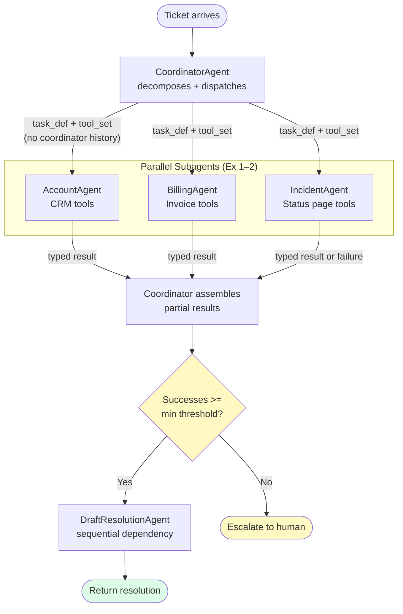
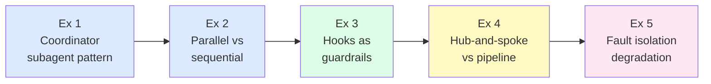
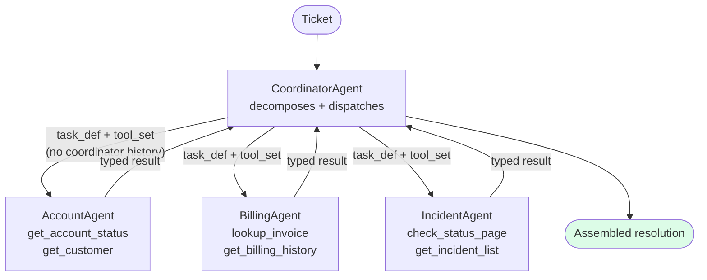
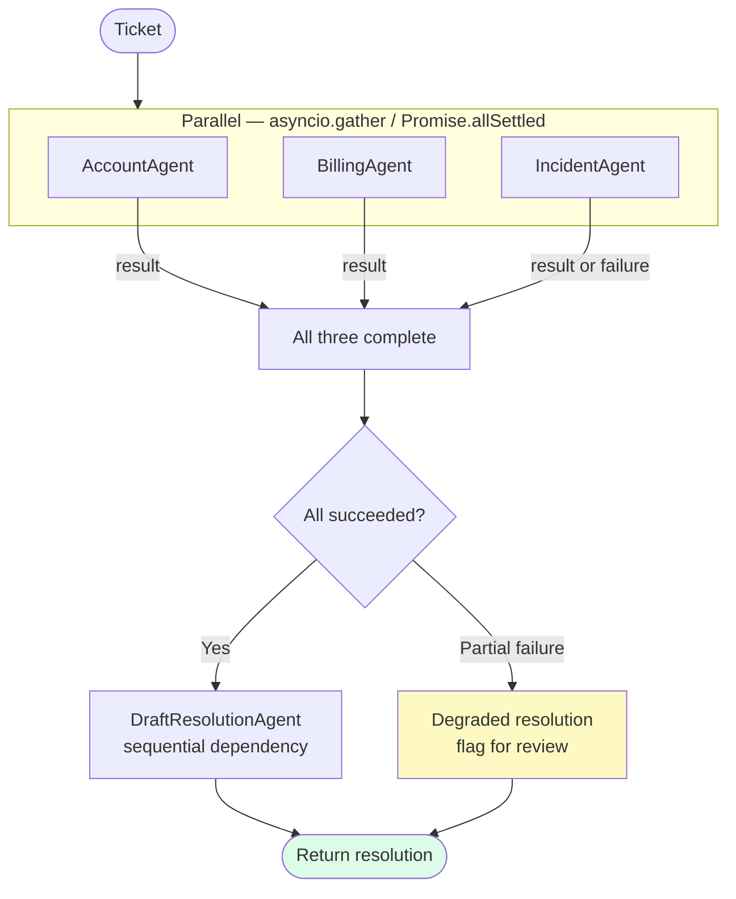
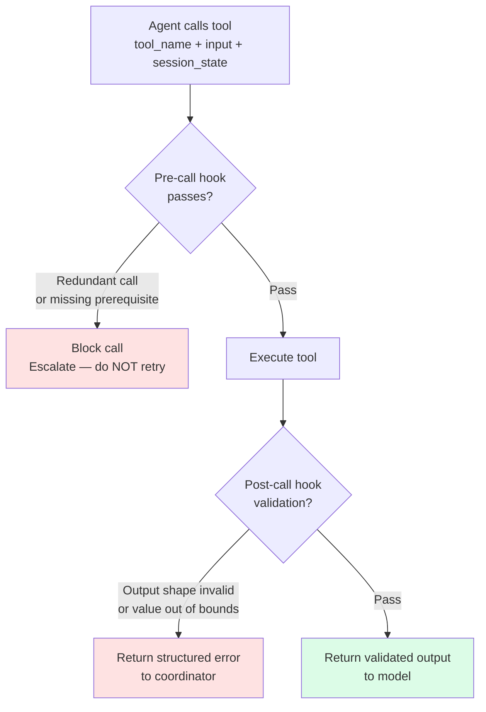
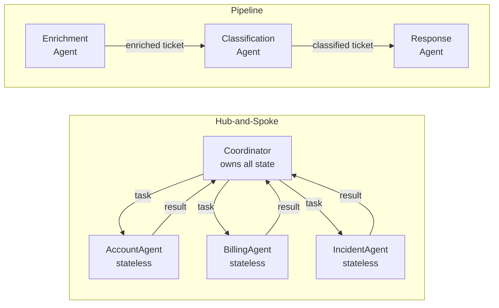
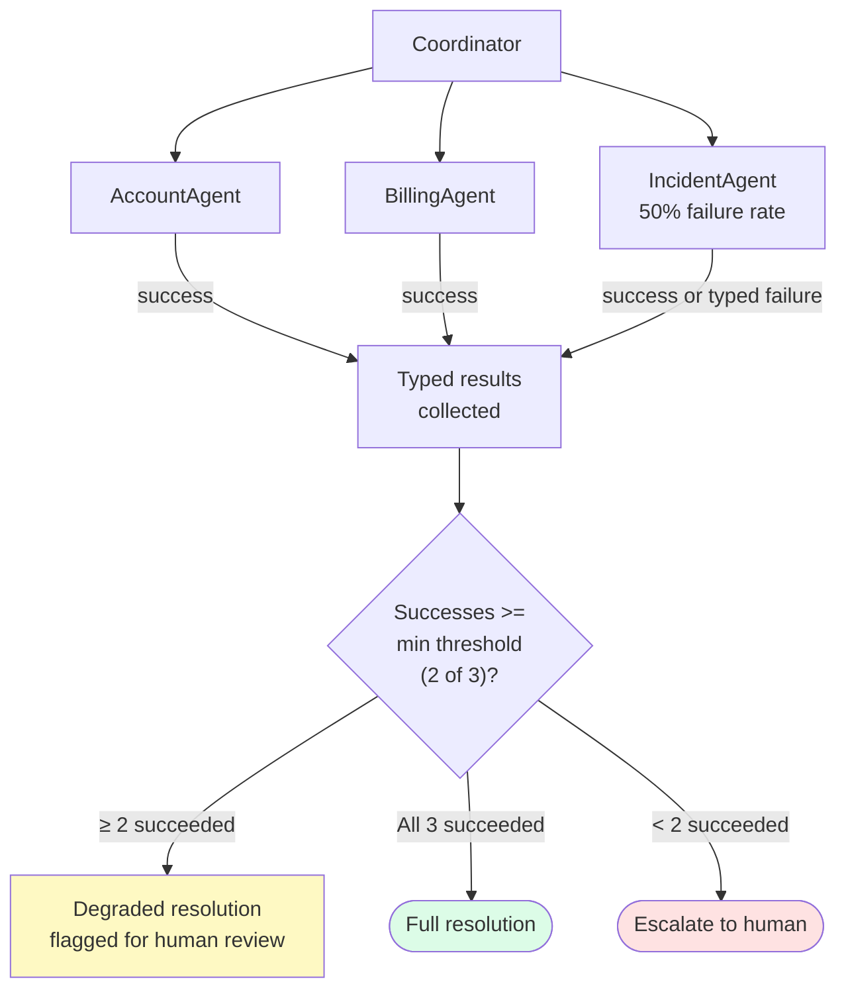

# Week 3 Lab — Agentic Architecture (Part 2)

> **Resolve context:** One resolution agent was never going to scale to 50,000 tickets a day. The architecture that replaced it — a coordinator that decomposes tickets and dispatches to specialist subagents — is exactly what the exam's "Multi-Agent Research System" scenario tests. These exercises build that system, then harden it with hooks.

---

## How It All Fits Together

The complete multi-agent architecture you build across these five exercises:



**Core idea:** The coordinator owns all state. Subagents receive only a task definition and a bounded tool set — not the coordinator's reasoning history. Context isolation is what makes each subagent independently testable, replaceable, and fault-isolatable.

---

## Exercise Progression



Exercises 1–2 build the multi-agent architecture. Exercise 3 hardens it with hooks. Exercises 4–5 broaden and stress-test the patterns.

---

## Learning Objectives

- Design and implement a coordinator/subagent architecture where each agent has a single, bounded responsibility
- Understand when to run subagents in parallel vs. in sequence and how to reason about the tradeoffs
- Implement pre-call and post-call hooks as programmatic guardrails — not prompt instructions
- Understand hub-and-spoke vs. pipeline multi-agent patterns and when each applies
- Build fault isolation: a failing subagent must not cascade into a coordinator failure

## Prerequisites

- Week 2 lab completed — you must understand iteration budgets, typed exits, and session state
- Anthropic SDK installed (`pip install anthropic` / `npm install @anthropic-ai/sdk`)
- `.env` with `ANTHROPIC_API_KEY`

**Languages:** Each exercise is implemented in both Python (`exercise_N.py`) and TypeScript (`exercise_N.ts`).

---

## Exercises

### Exercise 1 — The Coordinator/Subagent Pattern

**Goal:** Build a two-level agent hierarchy: a coordinator that decomposes a ticket, and specialist subagents that each handle one aspect of the resolution.



**Key insight:** Subagents receive a task definition and a tool set. They do not receive the coordinator's reasoning history. Context isolation is what makes subagents independently testable and replaceable.

**Scenario:** Resolve's most complex tickets require parallel investigation of account status, billing history, and known incidents. A single agent doing this sequentially is slower and harder to maintain. A coordinator dispatching to three specialist subagents is faster, testable in isolation, and replaceable one at a time.

**You will:**
1. Define three subagents with distinct tool sets: `AccountAgent` (CRM tools), `BillingAgent` (invoice tools), `IncidentAgent` (status page tools)
2. Build a `CoordinatorAgent` that receives a ticket, decides which subagents to invoke, and assembles their outputs into a single resolution
3. Verify that each subagent can be tested independently with a mock input — it has no dependency on the coordinator's internal state
4. Observe that the coordinator passes context *into* subagents but does not share its full message history — each subagent starts with a clean context

---

### Exercise 2 — Parallel vs. Sequential Execution

**Goal:** Understand the cost and correctness implications of running subagents in parallel versus in sequence, and implement both patterns.



**Key insight:** Parallelism saves time but introduces partial-failure semantics. A coordinator that waits for `Promise.all` will fail if any subagent throws. A coordinator that uses `Promise.allSettled` gets typed results for each — success or failure — and can make an informed decision.

**Scenario:** Resolve's three specialist subagents from Exercise 1 can run in parallel — none of them depends on the others' output. But the billing investigation must complete before the coordinator can decide whether to offer a credit. Some steps are parallelisable; others are not.

**You will:**
1. Run the three subagents in parallel using `asyncio.gather` (Python) or `Promise.all` (TypeScript) and measure wall-clock time vs. sequential execution
2. Introduce a dependency: the coordinator can only run `DraftResolutionAgent` after all three parallel subagents complete
3. Model the dependency as a DAG — draw it on paper, then implement it in code
4. Handle partial failure: if one parallel subagent fails, the others should still complete and the coordinator should receive a typed failure for the failed one

---

### Exercise 3 — Hooks as Programmatic Guardrails

**Goal:** Implement pre-call and post-call hooks that enforce rules the model cannot enforce on itself.



**Key insight:** A prompt instruction saying "always check account status before drafting a reply" can be ignored, misunderstood, or forgotten mid-conversation. A pre-call hook that blocks `draft_reply` if `get_account_status` has not yet been called this session cannot be bypassed.

**Scenario:** After the Chapter 1 incident, Resolve added hooks to every tool call. A pre-call hook checks whether the tool being called makes sense given the current session state. A post-call hook validates that the output is within expected bounds before passing it back to the model. These hooks are code — they do not rely on the model to police itself.

**You will:**
1. Implement a `pre_call_hook(tool_name, tool_input, session_state) → bool` that blocks redundant tool calls and calls to tools that require prior steps to complete first (e.g., `draft_reply` cannot be called before `get_account_status`)
2. Implement a `post_call_hook(tool_name, tool_output) → validated_output | error` that checks output shapes and returns a structured error if validation fails
3. Demonstrate that the hooks fire correctly by crafting tool calls that should be blocked
4. Verify that a blocked pre-call hook results in escalation, not a retry — the model should not be asked to try again with different parameters

---

### Exercise 4 — Hub-and-Spoke vs. Pipeline

**Goal:** Understand the structural difference between hub-and-spoke and pipeline multi-agent patterns and implement both for the same task.



**Key insight:** Hub-and-spoke isolates subagents from each other — they cannot see each other's work. Pipeline agents see the full accumulated output — which is useful for transformation workflows but creates context accumulation risk over many steps.

**Scenario:** Resolve uses hub-and-spoke for ticket triage (coordinator dispatches to specialists, collects results, decides). It uses a pipeline for batch processing (claim submitted → enrichment agent → classification agent → response agent — each step feeds the next). These are different patterns for different problems.

**You will:**
1. Implement the ticket resolution from Exercise 1 as a hub-and-spoke: coordinator owns all state, subagents are stateless workers
2. Re-implement the same resolution as a pipeline: each agent receives the previous agent's output and adds to it, passing a growing context object downstream
3. Run both on the same ticket and compare: which produces more auditable output? Which is easier to debug when step 3 fails?
4. Identify which pattern is appropriate when: (a) steps can run in parallel, (b) each step transforms the data, (c) you need a single authoritative decision at the end

---

### Exercise 5 — Fault Isolation and Graceful Degradation

**Goal:** Ensure that a subagent failure degrades the resolution gracefully rather than crashing the coordinator.



**Key insight:** Fault isolation is not about retrying failed subagents. It is about defining what a partial result looks like and making an explicit decision about whether it is good enough to act on.

**Scenario:** Resolve's `IncidentAgent` calls an external status page API that is sometimes unavailable. Without fault isolation, a 503 from the status page crashes the entire ticket resolution. With it, the coordinator produces a partial resolution — without incident context — and flags it for human review.

**You will:**
1. Simulate a subagent that fails 50% of the time (random exception)
2. Implement the coordinator so that it catches subagent failures and records them as typed failures — not exceptions that propagate up
3. Define a degraded resolution: what the coordinator should output when one of three subagents fails
4. Verify that the coordinator's output always has a defined shape regardless of which subagents succeeded or failed
5. Implement a minimum-subagent-success threshold: if fewer than 2 of 3 succeed, escalate rather than attempt a degraded resolution

---

## Lab Completion Checklist

Before moving to Week 4, answer these without looking:

- [ ] Why does a subagent receive a task definition but not the coordinator's full message history?
- [ ] What is the Python/TypeScript equivalent of `Promise.allSettled` and when do you use it instead of `Promise.all`?
- [ ] Write the signature of a pre-call hook. What should it return when a call is blocked?
- [ ] Name two things a post-call hook can catch that a JSON schema cannot enforce
- [ ] When is hub-and-spoke the better pattern? When is pipeline the better pattern?
- [ ] What is the minimum-subagent-success threshold pattern and why does it matter?

---

## Exam Connections

| Exercise | Domain | Exam Pattern Covered |
|---|---|---|
| 1 | D1 | Coordinator/subagent; context isolation between agents |
| 2 | D1 | Parallel vs. sequential; partial failure with `allSettled` |
| 3 | D1 | Hooks as programmatic guardrails — not prompt rules |
| 4 | D1 | Hub-and-spoke vs. pipeline pattern selection |
| 5 | D1, D5 | Fault isolation; degraded resolution; minimum success threshold |

---

## What's Next

Week 4 leaves the agent runtime and focuses on the developer environment — CLAUDE.md hierarchy, custom commands, plan mode, and non-interactive CI integration.

→ **[Week 4 Lab — Claude Code Configuration](../week-4-claude-code/README.md)**

---

## Running the Exercises

```bash
cd labs/week-3-agentic-architecture-part2
pip install anthropic python-dotenv
python exercise_1_coordinator_subagent.py
python exercise_2_parallel_sequential.py
python exercise_3_hooks.py
python exercise_4_hub_spoke_pipeline.py
python exercise_5_fault_isolation.py
```
