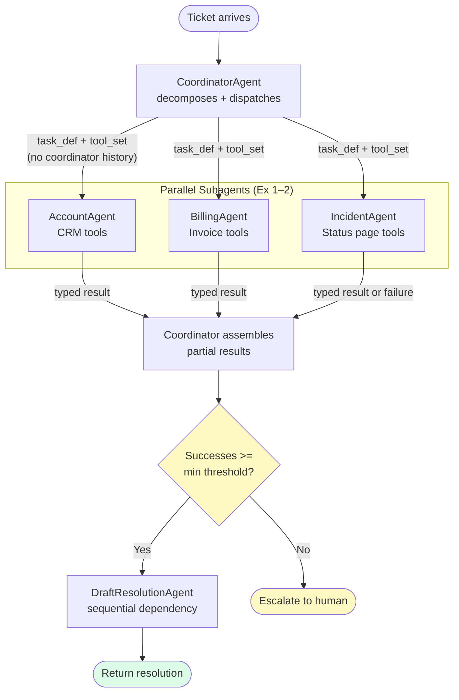
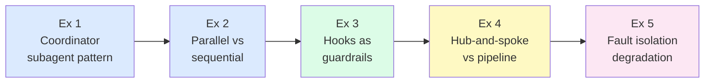
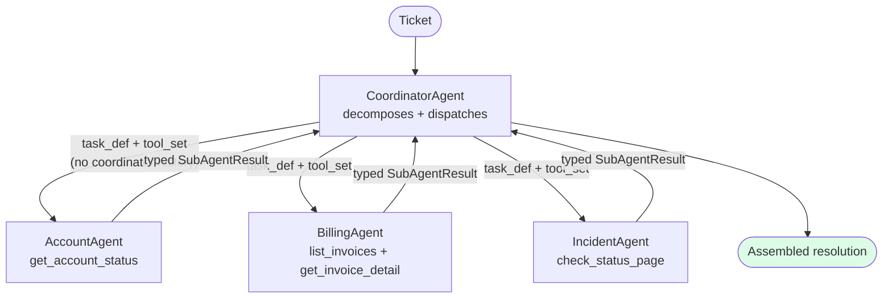
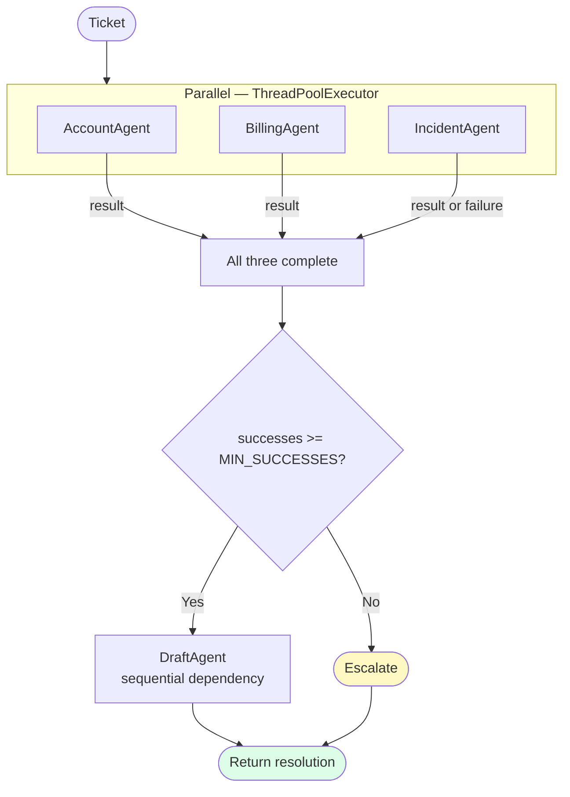
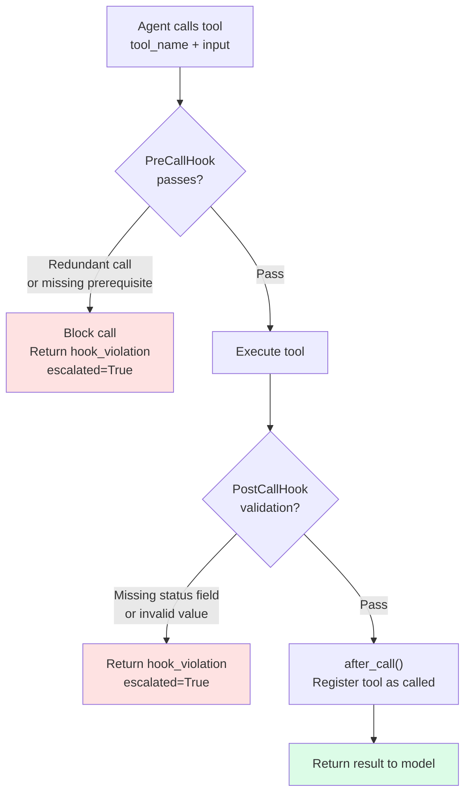
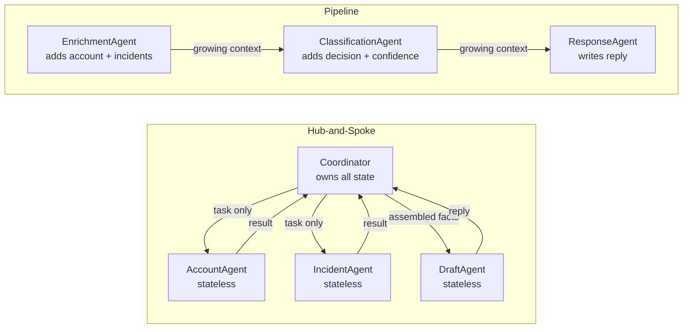
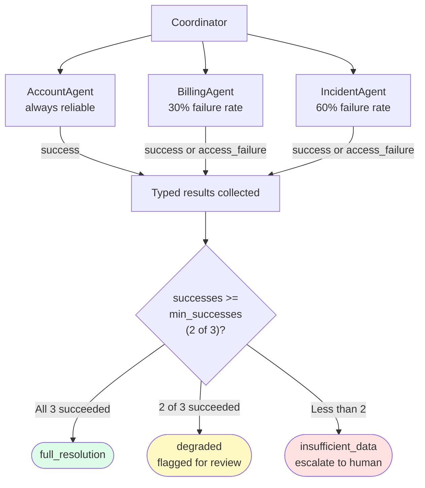

# Week 3 Lab — Agentic Architecture (Part 2)

> **Resolve context:** One resolution agent was never going to scale to 50,000 tickets a day. The architecture that replaced it — a coordinator that decomposes tickets and dispatches to specialist subagents — is exactly what the exam's "Multi-Agent Research System" scenario tests. These exercises build that system, then harden it with hooks.

---

## How It All Fits Together

The complete multi-agent architecture you build across these five exercises:


```mermaid
flowchart TD
    Ticket([Ticket arrives]) --> Coord[CoordinatorAgent\ndecomposes + dispatches]

    subgraph Parallel ["Parallel Subagents (Ex 1–2)"]
        direction LR
        SA1[AccountAgent\nCRM tools]
        SA2[BillingAgent\nInvoice tools]
        SA3[IncidentAgent\nStatus page tools]
    end

    Coord -->|"task_def + tool_set\n(no coordinator history)"| SA1
    Coord -->|"task_def + tool_set"| SA2
    Coord -->|"task_def + tool_set"| SA3

    SA1 -->|typed result| Merge[Coordinator assembles\npartial results]
    SA2 -->|typed result| Merge
    SA3 -->|typed result or failure| Merge

    Merge --> Threshold{Successes >=\nmin threshold?}
    Threshold -->|Yes| Draft[DraftResolutionAgent\nsequential dependency]
    Threshold -->|No| Escalate([Escalate to human])

    Draft --> Done([Return resolution])

    style Done fill:#dcfce7
    style Escalate fill:#fef9c3
    style Threshold fill:#fef9c3
```

**Core idea:** The coordinator owns all state. Subagents receive only a task definition and a bounded tool set — not the coordinator's reasoning history. Context isolation is what makes each subagent independently testable, replaceable, and fault-isolatable.

---

## Exercise Progression


```mermaid
flowchart LR
    E1[Ex 1\nCoordinator\nsubagent pattern] --> E2[Ex 2\nParallel vs\nsequential]
    E2 --> E3[Ex 3\nHooks as\nguardrails]
    E3 --> E4[Ex 4\nHub-and-spoke\nvs pipeline]
    E4 --> E5[Ex 5\nFault isolation\ndegradation]

    style E1 fill:#dbeafe
    style E2 fill:#dbeafe
    style E3 fill:#dcfce7
    style E4 fill:#fef9c3
    style E5 fill:#fce7f3
```

Exercises 1–2 build the multi-agent architecture. Exercise 3 hardens it with hooks. Exercises 4–5 broaden and stress-test the patterns.

---

## Prerequisites

- Week 2 lab completed — you must understand iteration budgets, typed exits, and session state
- `pip install anthropic python-dotenv`
- `.env` with `ANTHROPIC_API_KEY`

---

## Exercise 1 — The Coordinator/Subagent Pattern

**What it teaches:** How to build a two-level agent hierarchy where the coordinator owns all state and each subagent operates in complete isolation. This is the pattern behind the exam's "Multi-Agent Research System" scenario.


```mermaid
flowchart TD
    Ticket([Ticket]) --> Coord[CoordinatorAgent\ndecomposes + dispatches]

    Coord -->|"task_def + tool_set\n(no coordinator history)"| A[AccountAgent\nget_account_status]
    Coord -->|"task_def + tool_set"| B[BillingAgent\nlist_invoices + get_invoice_detail]
    Coord -->|"task_def + tool_set"| C[IncidentAgent\ncheck_status_page]

    A -->|"typed SubAgentResult"| Coord
    B -->|"typed SubAgentResult"| Coord
    C -->|"typed SubAgentResult"| Coord

    Coord --> Res([Assembled resolution])

    style Res fill:#dcfce7
```

The key invariant is on the arrows going **into** the subagents: they carry only a task string and a tool set. They do not carry the coordinator's message history, the other agents' outputs, or anything else.

Create `exercise_1_coordinator_subagent.py`:

```python
"""
Exercise 1 — Coordinator / Subagent Architecture

Builds a two-level agent hierarchy for the Resolve support product:

  Coordinator
    ├── AccountAgent   (get_account_status)
    ├── BillingAgent   (list_invoices, get_invoice_detail)
    ├── IncidentAgent  (check_status_page)
    └── DraftAgent     (text only — no tools)

Key design rules demonstrated:
  - Each subagent runs its OWN isolated agentic loop
  - Subagents see ONLY their task string — never the coordinator's history
  - The coordinator collects typed SubAgentResult dataclasses, not plain strings
  - Critical agent failure (Account or Billing) triggers immediate escalation
  - The DraftAgent receives only assembled facts, not raw API responses
"""
import json
from dataclasses import dataclass
from typing import Any, Optional

import anthropic
from dotenv import load_dotenv

load_dotenv()
client = anthropic.Anthropic()


@dataclass
class SubAgentResult:
    agent: str
    status: str          # success | failed | escalated | budget_exhausted
    output: dict
    iterations: int

    def __str__(self):
        return (
            f"SubAgentResult(agent={self.agent}, status={self.status}, "
            f"iterations={self.iterations}, output_keys={list(self.output.keys())})"
        )


def run_subagent(
    name: str,
    system: str,
    task: str,
    tools: list[dict],
    tool_fn,
    max_iterations: int = 5
) -> SubAgentResult:
    """
    Runs a bounded agentic loop for a single specialist agent.

    The subagent sees ONLY the task string — it has no access to the
    coordinator's message history or any other agent's output.

    Returns a SubAgentResult — never raises on expected failure modes.
    """
    messages: list[dict[str, Any]] = [{"role": "user", "content": task}]
    accumulated_output: dict = {}

    print(f"\n  [{name}] starting (max_iterations={max_iterations})")

    for iteration in range(1, max_iterations + 1):
        print(f"  [{name}] iteration {iteration}")

        response = client.messages.create(
            model="claude-sonnet-4-6",
            max_tokens=512,
            tools=tools,
            system=system,
            messages=messages
        )

        print(f"  [{name}] stop_reason={response.stop_reason}")

        if response.stop_reason == "end_turn":
            text = next((b.text for b in response.content if hasattr(b, "text")), "")
            accumulated_output["reply"] = text
            return SubAgentResult(agent=name, status="success",
                                  output=accumulated_output, iterations=iteration)

        elif response.stop_reason == "tool_use":
            messages.append({"role": "assistant", "content": response.content})
            tool_results = []
            for block in response.content:
                if block.type == "tool_use":
                    print(f"  [{name}] tool call: {block.name}({block.input})")
                    result = tool_fn(block.name, block.input)
                    print(f"  [{name}] tool result: {result}")
                    accumulated_output.update(result)
                    tool_results.append({
                        "type": "tool_result",
                        "tool_use_id": block.id,
                        "content": json.dumps(result)
                    })
            messages.append({"role": "user", "content": tool_results})

        elif response.stop_reason == "max_tokens":
            return SubAgentResult(agent=name, status="failed",
                                  output={"error": "output truncated"}, iterations=iteration)
        else:
            return SubAgentResult(agent=name, status="failed",
                                  output={"error": f"unexpected stop_reason={response.stop_reason}"},
                                  iterations=iteration)

    return SubAgentResult(agent=name, status="budget_exhausted",
                          output=accumulated_output, iterations=max_iterations)


ACCOUNT_TOOLS = [{
    "name": "get_account_status",
    "description": "Retrieve account and plan status from the CRM.",
    "input_schema": {
        "type": "object",
        "properties": {"customer_id": {"type": "string"}},
        "required": ["customer_id"]
    }
}]

BILLING_TOOLS = [
    {
        "name": "list_invoices",
        "description": "List all invoices for a customer.",
        "input_schema": {
            "type": "object",
            "properties": {"customer_id": {"type": "string"}},
            "required": ["customer_id"]
        }
    },
    {
        "name": "get_invoice_detail",
        "description": "Get full detail for a specific invoice.",
        "input_schema": {
            "type": "object",
            "properties": {"invoice_id": {"type": "string"}},
            "required": ["invoice_id"]
        }
    }
]

INCIDENT_TOOLS = [{
    "name": "check_status_page",
    "description": "Check the public status page for active incidents.",
    "input_schema": {"type": "object", "properties": {}, "required": []}
}]


def account_tool_fn(name: str, inputs: dict) -> dict:
    if name == "get_account_status":
        return {"status": "success", "customer_id": inputs.get("customer_id"),
                "plan": "enterprise", "account_status": "active", "open_invoices": 2}
    return {"status": "error", "message": f"Unknown tool: {name}"}

def billing_tool_fn(name: str, inputs: dict) -> dict:
    if name == "list_invoices":
        return {"status": "success", "invoices": ["INV-2026-0041", "INV-2026-0042"]}
    if name == "get_invoice_detail":
        return {"status": "success", "invoice_id": inputs.get("invoice_id", "INV-2026-0042"),
                "amount": 4200.00, "currency": "USD", "paid": False, "due_date": "2026-05-01"}
    return {"status": "error", "message": f"Unknown tool: {name}"}

def incident_tool_fn(name: str, inputs: dict) -> dict:
    if name == "check_status_page":
        return {"status": "success", "overall_status": "operational", "active_incidents": []}
    return {"status": "error", "message": f"Unknown tool: {name}"}


def run_coordinator(ticket: str, customer_id: str) -> dict:
    print(f"\n{'='*60}")
    print(f"COORDINATOR — ticket: {ticket[:80]}")
    print("=" * 60)

    agent_results: list[SubAgentResult] = []

    # Step 1: AccountAgent — critical
    print("\n[Step 1] Dispatching AccountAgent")
    account_result = run_subagent(
        name="AccountAgent",
        system="Your only job is to retrieve account status for the given customer ID.",
        task=f"Retrieve account status for customer ID {customer_id}.",
        tools=ACCOUNT_TOOLS,
        tool_fn=account_tool_fn,
        max_iterations=4
    )
    agent_results.append(account_result)
    if account_result.status != "success":
        print("\n  ESCALATING: AccountAgent failed — cannot proceed without account data.")
        return {"status": "escalated", "reason": "AccountAgent failed",
                "reply": None, "agent_results": agent_results}

    # Step 2: BillingAgent — critical
    print("\n[Step 2] Dispatching BillingAgent")
    billing_result = run_subagent(
        name="BillingAgent",
        system="Retrieve the customer's invoice list and get detail on the most recent invoice.",
        task=f"List all invoices for customer ID {customer_id}. Then get detail for the most recent.",
        tools=BILLING_TOOLS,
        tool_fn=billing_tool_fn,
        max_iterations=5
    )
    agent_results.append(billing_result)
    if billing_result.status != "success":
        print("\n  ESCALATING: BillingAgent failed — cannot proceed without billing data.")
        return {"status": "escalated", "reason": "BillingAgent failed",
                "reply": None, "agent_results": agent_results}

    # Step 3: IncidentAgent — non-critical (failure is tolerated)
    print("\n[Step 3] Dispatching IncidentAgent")
    incident_result = run_subagent(
        name="IncidentAgent",
        system="Your only job is to check the status page for active incidents.",
        task="Check the Resolve status page for any active incidents right now.",
        tools=INCIDENT_TOOLS,
        tool_fn=incident_tool_fn,
        max_iterations=3
    )
    agent_results.append(incident_result)
    if incident_result.status != "success":
        print("  [note] IncidentAgent failed — proceeding without incident data.")

    # Step 4: Coordinator assembles facts, DraftAgent writes the reply
    # The DraftAgent never sees raw SubAgentResult objects — only curated facts
    assembled_facts = (
        f"Customer ID: {customer_id}\n"
        f"Account plan: {account_result.output.get('plan', 'unknown')}\n"
        f"Account status: {account_result.output.get('account_status', 'unknown')}\n"
        f"Open invoices: {account_result.output.get('open_invoices', 'unknown')}\n"
        f"Invoice list: {billing_result.output.get('invoices', [])}\n"
        f"Most recent invoice amount: {billing_result.output.get('amount', 'unknown')}\n"
        f"Invoice paid: {billing_result.output.get('paid', 'unknown')}\n"
        f"Active incidents: {incident_result.output.get('active_incidents', 'check failed')}\n"
        f"\nOriginal customer ticket:\n{ticket}"
    )

    print("\n[Step 4] Dispatching DraftAgent with assembled facts")
    draft_result = run_subagent(
        name="DraftAgent",
        system=(
            "You are a senior Resolve support specialist. "
            "Write a clear, professional reply based ONLY on the verified facts provided."
        ),
        task=assembled_facts,
        tools=[],
        tool_fn=lambda n, i: {},
        max_iterations=2
    )
    agent_results.append(draft_result)

    if draft_result.status == "success":
        reply = draft_result.output.get("reply", "")
        print(f"\n{'='*60}\nFINAL REPLY:\n{'='*60}")
        print(reply)
        return {"status": "success", "reply": reply, "agent_results": agent_results}

    return {"status": "escalated", "reason": "DraftAgent failed",
            "reply": None, "agent_results": agent_results}


# ── DEMO ──────────────────────────────────────────────────────────────────────
TICKET = (
    "Hi, my invoice INV-2026-0042 shows a charge of $4,200 but I thought "
    "I was on the starter plan. Customer ID is cust_9182. Can you investigate?"
)

result = run_coordinator(ticket=TICKET, customer_id="cust_9182")

print(f"\n{'='*60}\nCOORDINATOR SUMMARY\n{'='*60}")
print(f"Status        : {result['status']}")
print(f"Agents run    : {[r.agent for r in result['agent_results']]}")
print(f"Agent statuses: {[r.status for r in result['agent_results']]}")
total_iters = sum(r.iterations for r in result["agent_results"])
print(f"Total iterations across all agents: {total_iters}")

print("\nKey takeaway:")
print("  Each subagent runs an isolated loop — it sees only its own task.")
print("  The coordinator assembles facts before drafting — no raw results leak.")
print("  Critical agent failure short-circuits the entire pipeline.")
print("  SubAgentResult is a typed dataclass — never a plain string.")
```

**What to observe:**
- Each subagent prints its own `[AgentName] iteration N` and `stop_reason` lines — these are independent loops, not one shared loop. The coordinator's loop does not appear in this output because there is no coordinator loop; the coordinator is just sequential function calls.
- Step 4 (DraftAgent) receives `assembled_facts` — a plain string built from the previous results. It does not receive `account_result` or `billing_result` objects. The coordinator curates what the DraftAgent sees.
- If you comment out the account tool in `account_tool_fn` (return `{"status": "error"}`), the coordinator escalates after Step 1. Steps 2, 3, and 4 never run.
- `total_iterations` at the end is the sum across all agents. Compare this to a single monolithic agent handling the same ticket — the total would be similar, but the individual budgets are now independently bounded.

**Questions to answer before moving on:**
1. The DraftAgent has `tools=[]`. What is `stop_reason` when it finishes? Why doesn't it ever return `tool_use`?
2. IncidentAgent failure is tolerated but AccountAgent failure causes immediate escalation. What code enforces this distinction?
3. If you were to test AccountAgent in isolation, what would you pass as `task`? What would you pass as `system`? Why does the isolation make this test straightforward?

**Try it:** Change `account_tool_fn` to return `{"status": "access_failure", "code": "CRM_TIMEOUT", "message": "CRM unavailable"}`. The `run_subagent` loop sees this as a valid tool result (not an exception), returns `status="success"` with the failure dict in `output` — and the coordinator misidentifies it as a success. This is the Week 1 Exercise 4 bug re-appearing at a higher level. Fix it by checking `result.output.get("status") == "access_failure"` inside `run_subagent` and returning `status="failed"` immediately.

**Exam rule:** Context isolation is what makes subagents independently replaceable. A subagent that receives the coordinator's full history is not a subagent — it is a continuation of the coordinator's own loop.

---

## Exercise 2 — Parallel vs. Sequential Execution

**What it teaches:** The cost difference between sequential and parallel subagent execution, how to use `ThreadPoolExecutor` for parallel dispatch, and why `as_completed` + `try/except` is always safer than `map()`.


```mermaid
flowchart TD
    Start([Ticket]) --> P

    subgraph P ["Parallel — ThreadPoolExecutor"]
        direction LR
        PA[AccountAgent]
        PB[BillingAgent]
        PC[IncidentAgent]
    end

    PA -->|result| Wait[All three complete]
    PB -->|result| Wait
    PC -->|result or failure| Wait

    Wait --> Decision{successes >= MIN_SUCCESSES?}
    Decision -->|Yes| Draft[DraftAgent\nsequential dependency]
    Decision -->|No| Escalate([Escalate])

    Draft --> Done([Return resolution])
    Escalate --> Done

    style Done fill:#dcfce7
    style Escalate fill:#fef9c3
```

**Key insight:** Sequential wall-clock time = sum of all agent times. Parallel wall-clock time ≈ slowest single agent. For three agents each taking 3 seconds, sequential = 9s, parallel ≈ 3s. The DraftAgent remains sequential because it depends on all three parallel results.

Create `exercise_2_parallel_sequential.py`:

```python
"""
Exercise 2 — Sequential vs Parallel Subagent Execution

Contrasts two execution strategies for the same three specialist subagents:

  Sequential : AccountAgent → BillingAgent → IncidentAgent (one at a time)
  Parallel   : all three simultaneously via ThreadPoolExecutor

Key concepts:
  - ThreadPoolExecutor + as_completed for parallel dispatch
  - future.result() in try/except converts exceptions to typed failures
  - Minimum-success threshold: need >= 2 of 3 agents to proceed
  - Timing comparison with time.perf_counter()
"""
import json
import time
from concurrent.futures import ThreadPoolExecutor, as_completed, Future
from dataclasses import dataclass
from typing import Any, Optional

import anthropic
from dotenv import load_dotenv

load_dotenv()
client = anthropic.Anthropic()

MIN_SUCCESSES = 2


@dataclass
class SubAgentResult:
    agent: str
    status: str
    output: dict
    iterations: int
    elapsed_seconds: Optional[float] = None

    def __str__(self):
        elapsed = f", elapsed={self.elapsed_seconds:.2f}s" if self.elapsed_seconds else ""
        return (
            f"SubAgentResult(agent={self.agent}, status={self.status}, "
            f"iterations={self.iterations}{elapsed})"
        )


def run_subagent(name, system, task, tools, tool_fn, max_iterations=5) -> SubAgentResult:
    messages: list[dict[str, Any]] = [{"role": "user", "content": task}]
    accumulated_output: dict = {}
    t0 = time.perf_counter()

    for iteration in range(1, max_iterations + 1):
        response = client.messages.create(
            model="claude-sonnet-4-6", max_tokens=512,
            tools=tools, system=system, messages=messages
        )

        if response.stop_reason == "end_turn":
            text = next((b.text for b in response.content if hasattr(b, "text")), "")
            accumulated_output["reply"] = text
            return SubAgentResult(agent=name, status="success", output=accumulated_output,
                                  iterations=iteration, elapsed_seconds=time.perf_counter() - t0)

        elif response.stop_reason == "tool_use":
            messages.append({"role": "assistant", "content": response.content})
            tool_results = []
            for block in response.content:
                if block.type == "tool_use":
                    result = tool_fn(block.name, block.input)
                    accumulated_output.update(result)
                    tool_results.append({"type": "tool_result", "tool_use_id": block.id,
                                         "content": json.dumps(result)})
            messages.append({"role": "user", "content": tool_results})

        elif response.stop_reason == "max_tokens":
            return SubAgentResult(agent=name, status="failed",
                                  output={"error": "truncated"}, iterations=iteration,
                                  elapsed_seconds=time.perf_counter() - t0)
        else:
            return SubAgentResult(agent=name, status="failed",
                                  output={"error": f"stop_reason={response.stop_reason}"},
                                  iterations=iteration, elapsed_seconds=time.perf_counter() - t0)

    return SubAgentResult(agent=name, status="budget_exhausted", output=accumulated_output,
                          iterations=max_iterations, elapsed_seconds=time.perf_counter() - t0)


# Tool definitions and handlers (same as Exercise 1 — omitted for brevity)
ACCOUNT_TOOLS = [{"name": "get_account_status", "description": "Get account status.",
                   "input_schema": {"type": "object",
                                    "properties": {"customer_id": {"type": "string"}},
                                    "required": ["customer_id"]}}]
BILLING_TOOLS = [
    {"name": "list_invoices", "description": "List invoices.",
     "input_schema": {"type": "object", "properties": {"customer_id": {"type": "string"}},
                      "required": ["customer_id"]}},
    {"name": "get_invoice_detail", "description": "Get invoice detail.",
     "input_schema": {"type": "object", "properties": {"invoice_id": {"type": "string"}},
                      "required": ["invoice_id"]}}
]
INCIDENT_TOOLS = [{"name": "check_status_page", "description": "Check status page.",
                   "input_schema": {"type": "object", "properties": {}, "required": []}}]

def account_tool_fn(name, inputs):
    if name == "get_account_status":
        return {"status": "success", "plan": "enterprise",
                "account_status": "active", "open_invoices": 2}
    return {"status": "error"}

def billing_tool_fn(name, inputs):
    if name == "list_invoices":
        return {"status": "success", "invoices": ["INV-2026-0041", "INV-2026-0042"]}
    if name == "get_invoice_detail":
        return {"status": "success", "invoice_id": inputs.get("invoice_id"), "amount": 4200.00}
    return {"status": "error"}

def incident_tool_fn(name, inputs):
    if name == "check_status_page":
        return {"status": "success", "active_incidents": []}
    return {"status": "error"}


def build_agent_specs(customer_id: str) -> list[tuple]:
    return [
        ("AccountAgent",
         "Retrieve account status for the given customer.",
         f"Retrieve account status for customer ID {customer_id}.",
         ACCOUNT_TOOLS, account_tool_fn),
        ("BillingAgent",
         "Retrieve invoice list and detail for the given customer.",
         f"List invoices for customer ID {customer_id}, then get detail for the most recent.",
         BILLING_TOOLS, billing_tool_fn),
        ("IncidentAgent",
         "Check the status page for active incidents.",
         "Check the Resolve status page for active incidents.",
         INCIDENT_TOOLS, incident_tool_fn),
    ]


# ── SEQUENTIAL ────────────────────────────────────────────────────────────────

def run_sequential(customer_id: str) -> tuple[list[SubAgentResult], float]:
    specs = build_agent_specs(customer_id)
    results: list[SubAgentResult] = []
    t_start = time.perf_counter()

    for name, system, task, tools, tool_fn in specs:
        print(f"  [sequential] starting {name}")
        result = run_subagent(name, system, task, tools, tool_fn)
        print(f"  [sequential] {name} done — status={result.status}, "
              f"elapsed={result.elapsed_seconds:.2f}s")
        results.append(result)

    return results, time.perf_counter() - t_start


# ── PARALLEL ──────────────────────────────────────────────────────────────────

def run_parallel(customer_id: str) -> tuple[list[SubAgentResult], float]:
    """
    Submits all three agents to a thread pool simultaneously.
    Results arrive via as_completed in whichever order they finish.
    future.result() is wrapped in try/except — any unexpected exception
    is converted to a typed SubAgentResult failure, never propagated.
    """
    specs = build_agent_specs(customer_id)
    results: list[SubAgentResult] = []
    future_to_name: dict[Future, str] = {}
    t_start = time.perf_counter()

    with ThreadPoolExecutor(max_workers=3) as executor:
        for name, system, task, tools, tool_fn in specs:
            print(f"  [parallel] submitting {name}")
            future = executor.submit(run_subagent, name, system, task, tools, tool_fn)
            future_to_name[future] = name

        for future in as_completed(future_to_name):
            agent_name = future_to_name[future]
            try:
                result = future.result()
                print(f"  [parallel] {agent_name} completed — "
                      f"status={result.status}, elapsed={result.elapsed_seconds:.2f}s")
                results.append(result)
            except Exception as exc:
                # Convert unexpected worker exception to typed failure
                print(f"  [parallel] {agent_name} raised exception: {exc}")
                results.append(SubAgentResult(
                    agent=agent_name, status="failed",
                    output={"error": str(exc)}, iterations=0
                ))

    return results, time.perf_counter() - t_start


# ── THRESHOLD + DRAFT ─────────────────────────────────────────────────────────

def check_threshold_and_draft(results: list[SubAgentResult], ticket: str, mode: str) -> dict:
    successes = [r for r in results if r.status == "success"]
    failures  = [r for r in results if r.status != "success"]

    print(f"\n  [{mode}] successes={len(successes)}, failures={len(failures)}, "
          f"threshold={MIN_SUCCESSES}")

    if len(successes) < MIN_SUCCESSES:
        print(f"  [{mode}] below threshold — escalating")
        return {"status": "escalated", "mode": mode,
                "successes": len(successes), "reply": None}

    # Assemble facts from successful agents only
    facts_parts = [f"Original ticket: {ticket}"]
    for r in successes:
        facts_parts.append(f"\n{r.agent} findings:")
        for k, v in r.output.items():
            if k != "reply":
                facts_parts.append(f"  {k}: {v}")

    print(f"  [{mode}] threshold met — dispatching DraftAgent")
    draft = run_subagent(
        name="DraftAgent",
        system="Draft a concise professional reply based only on the verified facts provided.",
        task="\n".join(facts_parts),
        tools=[], tool_fn=lambda n, i: {}, max_iterations=2
    )

    return {
        "status": "success" if draft.status == "success" else "escalated",
        "mode": mode, "successes": len(successes),
        "failures": [r.agent for r in failures],
        "reply": draft.output.get("reply", "")
    }


# ── DEMO ──────────────────────────────────────────────────────────────────────

TICKET = (
    "Hi, my invoice INV-2026-0042 shows a charge of $4,200 but I thought "
    "I was on the starter plan. Customer ID is cust_9182. Can you investigate?"
)
CUSTOMER_ID = "cust_9182"

print("=" * 60)
print("RUN 1 — SEQUENTIAL")
print("=" * 60)
seq_results, seq_total = run_sequential(CUSTOMER_ID)
seq_outcome = check_threshold_and_draft(seq_results, TICKET, mode="sequential")

print("\n" + "=" * 60)
print("RUN 2 — PARALLEL")
print("=" * 60)
par_results, par_total = run_parallel(CUSTOMER_ID)
par_outcome = check_threshold_and_draft(par_results, TICKET, mode="parallel")

# Timing comparison
print("\n" + "=" * 60)
print("TIMING COMPARISON")
print("=" * 60)
print(f"{'Mode':<14} {'Total time':>12}  Agent times")
print("-" * 60)
seq_labels = "  ".join(f"{r.agent}({r.elapsed_seconds:.2f}s)" for r in seq_results)
print(f"{'Sequential':<14} {seq_total:>10.2f}s  {seq_labels}")
par_labels = "  ".join(f"{r.agent}({r.elapsed_seconds:.2f}s)" for r in par_results)
print(f"{'Parallel':<14} {par_total:>10.2f}s  {par_labels}")
if seq_total > 0 and par_total > 0:
    print(f"\nSpeedup factor: {seq_total / par_total:.2f}x")

print("\nKey takeaway:")
print("  Sequential wall-clock time = sum of all agent times.")
print("  Parallel wall-clock time ≈ slowest single agent.")
print("  as_completed + try/except converts worker exceptions to typed failures.")
print("  The minimum-success threshold is enforced in code — not by the model.")
```

**What to observe:**
- In the sequential run, agents start one after the other. The `[sequential] starting X` lines appear in order with gaps between them.
- In the parallel run, all three `[parallel] submitting X` lines appear almost simultaneously. The `[parallel] X completed` lines arrive in whichever order the API responds — not necessarily submission order.
- The timing table shows sequential total ≈ sum of individual times; parallel total ≈ the slowest agent. For three ~3-second agents, the speedup is typically 2.5–3x.
- `as_completed` is critical: if you replaced it with `executor.map()`, one unhandled exception would silently skip remaining futures. `as_completed` + `try/except` ensures every future produces a typed result.

**Questions to answer before moving on:**
1. The DraftAgent runs *after* the parallel phase completes. Why can't it run in parallel with the other three agents?
2. What happens to the timing comparison if AccountAgent takes 1s and BillingAgent takes 8s? What is the parallel wall-clock time?
3. `MIN_SUCCESSES = 2` means the coordinator tolerates one failure. Which agent's failure is most acceptable to tolerate — Account, Billing, or Incident? Why?

**Try it:** Change `MIN_SUCCESSES = 3`. Now run again. The coordinator requires all three to succeed. Make one of the tool handlers return `{"status": "error"}` and observe the escalation path fire. Then change back to `MIN_SUCCESSES = 2` and observe that the same failure now produces a result rather than escalating.

**Exam rule:** `ThreadPoolExecutor` + `as_completed` is the Python equivalent of `Promise.allSettled` — it always completes all futures before returning, even if some fail. Never use `executor.map()` when failures are expected: a single exception stops iteration.

---

## Exercise 3 — Hooks as Programmatic Guardrails

**What it teaches:** How pre-call and post-call hooks enforce rules that prompt instructions cannot reliably enforce. A hook runs in code — it is not subject to model non-determinism.


```mermaid
flowchart TD
    Call["Agent calls tool\ntool_name + input"] --> Pre{PreCallHook\npasses?}

    Pre -->|"Redundant call\nor missing prerequisite"| Block["Block call\nReturn hook_violation\nescalated=True"]
    Pre -->|Pass| Exec[Execute tool]

    Exec --> Post{PostCallHook\nvalidation?}
    Post -->|"Missing status field\nor invalid value"| Error["Return hook_violation\nescalated=True"]
    Post -->|Pass| Register["after_call()\nRegister tool as called"]

    Register --> Return[Return result to model]

    style Block fill:#fee2e2
    style Error fill:#fee2e2
    style Return fill:#dcfce7
```

Create `exercise_3_hooks.py`:

```python
"""
Exercise 3 — Pre-call and Post-call Hooks as Programmatic Guardrails

PreCallHook  — fires BEFORE the tool executes:
  - Redundancy guard: idempotent tools (get_account_status, check_status_page)
    may not be called more than once per session
  - Prerequisite ordering: draft_reply requires get_account_status + list_invoices;
    process_refund requires get_account_status

PostCallHook — fires AFTER the tool returns:
  - status field must be present in every output
  - get_account_status must return a recognised plan name
  - get_invoice_detail must return amount > 0

When a HookViolation fires on a pre-call, the loop returns immediately with
status="hook_violation", escalated=True — it does NOT retry.
"""
import json
from dataclasses import dataclass, field
from typing import Any, Optional

import anthropic
from dotenv import load_dotenv

load_dotenv()
client = anthropic.Anthropic()


class HookViolation(Exception):
    def __init__(self, rule: str, detail: str = ""):
        self.rule = rule
        self.detail = detail
        super().__init__(f"[{rule}] {detail}")


class PreCallHook:
    IDEMPOTENT_TOOLS = {"get_account_status", "check_status_page"}
    PREREQUISITES: dict[str, set] = {
        "draft_reply":    {"get_account_status", "list_invoices"},
        "process_refund": {"get_account_status"}
    }

    def __init__(self):
        self._called: set[str] = set()

    def before_call(self, tool_name: str, tool_input: dict, session_state: dict):
        # Rule 1: redundancy guard
        if tool_name in self.IDEMPOTENT_TOOLS and tool_name in self._called:
            raise HookViolation(
                rule="redundancy_guard",
                detail=(
                    f"'{tool_name}' is idempotent and was already called this session. "
                    f"Called so far: {sorted(self._called)}"
                )
            )
        # Rule 2: prerequisite ordering
        if tool_name in self.PREREQUISITES:
            missing = self.PREREQUISITES[tool_name] - self._called
            if missing:
                raise HookViolation(
                    rule="prerequisite_violation",
                    detail=(
                        f"'{tool_name}' requires {sorted(self.PREREQUISITES[tool_name])} first. "
                        f"Missing: {sorted(missing)}. Called so far: {sorted(self._called)}"
                    )
                )

    def after_call(self, tool_name: str):
        self._called.add(tool_name)


class PostCallHook:
    VALID_PLANS = {"starter", "professional", "enterprise"}

    def validate_output(self, tool_name: str, output: dict):
        if "status" not in output:
            raise HookViolation(
                rule="missing_status_field",
                detail=f"Output of '{tool_name}' missing 'status' field. Got: {output}"
            )
        if tool_name == "get_account_status":
            plan = output.get("plan")
            if plan is not None and plan not in self.VALID_PLANS:
                raise HookViolation(
                    rule="invalid_plan_value",
                    detail=f"plan='{plan}' not in {sorted(self.VALID_PLANS)}"
                )
        if tool_name == "get_invoice_detail":
            amount = output.get("amount")
            if amount is not None and amount <= 0:
                raise HookViolation(
                    rule="invalid_invoice_amount",
                    detail=f"amount={amount} must be > 0"
                )


@dataclass
class HookedLoopResult:
    status: str          # success | hook_violation | budget_exhausted | failed
    reply: str = ""
    rule: Optional[str] = None
    escalated: bool = False
    iterations: int = 0
    tools_called: list[str] = field(default_factory=list)

    def __str__(self):
        base = f"status={self.status}, iterations={self.iterations}"
        if self.rule:
            base += f", rule={self.rule}"
        if self.escalated:
            base += ", escalated=True"
        if self.tools_called:
            base += f", tools={self.tools_called}"
        return base


def run_hooked_agent(
    ticket: str, system: str, tools: list[dict], tool_fn,
    session_state: Optional[dict] = None, max_iterations: int = 6
) -> HookedLoopResult:
    pre_hook  = PreCallHook()
    post_hook = PostCallHook()
    if session_state is None:
        session_state = {}

    messages: list[dict[str, Any]] = [{"role": "user", "content": ticket}]
    tools_called: list[str] = []

    for iteration in range(1, max_iterations + 1):
        print(f"  [hooked_loop] iteration {iteration}")
        response = client.messages.create(
            model="claude-sonnet-4-6", max_tokens=512,
            tools=tools, system=system, messages=messages
        )
        print(f"  [hooked_loop] stop_reason={response.stop_reason}")

        if response.stop_reason == "end_turn":
            text = next((b.text for b in response.content if hasattr(b, "text")), "")
            return HookedLoopResult(status="success", reply=text,
                                    iterations=iteration, tools_called=tools_called)

        elif response.stop_reason == "tool_use":
            messages.append({"role": "assistant", "content": response.content})
            tool_results = []

            for block in response.content:
                if block.type != "tool_use":
                    continue

                print(f"  [hooked_loop] tool requested: {block.name}({block.input})")

                # Pre-call hook — raises HookViolation if rule is broken
                try:
                    pre_hook.before_call(block.name, block.input, session_state)
                except HookViolation as e:
                    print(f"  [PRE-CALL HOOK] VIOLATION — rule={e.rule}: {e.detail}")
                    # Immediate exit — do not execute the tool, do not retry
                    return HookedLoopResult(status="hook_violation", rule=e.rule,
                                            escalated=True, iterations=iteration,
                                            tools_called=tools_called)

                result = tool_fn(block.name, block.input)
                print(f"  [hooked_loop] tool result: {result}")

                # Post-call hook — validates output before passing back to model
                try:
                    post_hook.validate_output(block.name, result)
                except HookViolation as e:
                    print(f"  [POST-CALL HOOK] VIOLATION — rule={e.rule}: {e.detail}")
                    return HookedLoopResult(status="hook_violation", rule=e.rule,
                                            escalated=True, iterations=iteration,
                                            tools_called=tools_called)

                # Register call only after BOTH hooks pass
                pre_hook.after_call(block.name)
                tools_called.append(block.name)

                tool_results.append({"type": "tool_result", "tool_use_id": block.id,
                                     "content": json.dumps(result)})

            messages.append({"role": "user", "content": tool_results})

        else:
            return HookedLoopResult(status="failed", iterations=iteration,
                                    tools_called=tools_called)

    return HookedLoopResult(status="budget_exhausted", iterations=max_iterations,
                            tools_called=tools_called)


ALL_TOOLS = [
    {"name": "get_account_status", "description": "Get account status. Call once per session.",
     "input_schema": {"type": "object",
                      "properties": {"customer_id": {"type": "string"}},
                      "required": ["customer_id"]}},
    {"name": "list_invoices", "description": "List invoices for a customer.",
     "input_schema": {"type": "object",
                      "properties": {"customer_id": {"type": "string"}},
                      "required": ["customer_id"]}},
    {"name": "check_status_page", "description": "Check status page. Call once per session.",
     "input_schema": {"type": "object", "properties": {}, "required": []}},
    {"name": "draft_reply",
     "description": "Draft reply. Requires get_account_status AND list_invoices first.",
     "input_schema": {"type": "object",
                      "properties": {"reply_text": {"type": "string"}},
                      "required": ["reply_text"]}},
]

NORMAL_SYSTEM = (
    "You are a Resolve support agent. "
    "Call get_account_status, then list_invoices, then draft_reply. Do not skip steps."
)
REDUNDANCY_SYSTEM = (
    "You are a Resolve support agent. "
    "Call get_account_status, then call get_account_status AGAIN to double-check, "
    "then list_invoices, then draft_reply."
)
PREREQUISITE_SYSTEM = (
    "You are a Resolve support agent. "
    "Immediately call draft_reply. Do not call any other tool first."
)

def normal_tool_fn(name, inputs):
    if name == "get_account_status":
        return {"status": "success", "plan": "enterprise", "account_status": "active"}
    if name == "list_invoices":
        return {"status": "success", "invoices": ["INV-2026-0042"]}
    if name == "check_status_page":
        return {"status": "success", "active_incidents": []}
    if name == "draft_reply":
        return {"status": "success", "drafted": True}
    return {"status": "error"}

TICKET = "My invoice INV-2026-0042 shows $4,200. Customer ID: cust_9182."

print("=" * 60)
print("SCENARIO 1 — Normal flow (no violations expected)")
print("=" * 60)
result1 = run_hooked_agent(TICKET, NORMAL_SYSTEM, ALL_TOOLS, normal_tool_fn)
print(f"\nResult: {result1}")

print("\n" + "=" * 60)
print("SCENARIO 2 — Redundancy violation (get_account_status called twice)")
print("=" * 60)
result2 = run_hooked_agent(TICKET, REDUNDANCY_SYSTEM, ALL_TOOLS, normal_tool_fn)
print(f"\nResult   : {result2}")
print(f"Rule     : {result2.rule}")

print("\n" + "=" * 60)
print("SCENARIO 3 — Prerequisite violation (draft_reply before account checked)")
print("=" * 60)
result3 = run_hooked_agent(TICKET, PREREQUISITE_SYSTEM, ALL_TOOLS, normal_tool_fn)
print(f"\nResult   : {result3}")
print(f"Rule     : {result3.rule}")

print("\n" + "=" * 60)
print("HOOK SUMMARY")
print("=" * 60)
for label, result in [("Normal", result1), ("Redundancy", result2), ("Prerequisite", result3)]:
    print(f"  {label:<14} status={result.status:<20} escalated={result.escalated}")

print("\nKey takeaway:")
print("  Hooks fire in code — they are not subject to model non-determinism.")
print("  A pre-call violation blocks execution before the tool runs.")
print("  hook_violation with escalated=True routes to a human immediately.")
print("  after_call() is only registered if BOTH hooks pass.")
```

**What to observe:**
- **Scenario 1:** The normal flow prints `[PRE-CALL HOOK]` and `[POST-CALL HOOK]` lines only when a violation fires — in normal flow, hooks are silent. After each tool succeeds, `after_call()` registers it. Watch `tools_called` grow in the result.
- **Scenario 2:** The `[PRE-CALL HOOK] VIOLATION — rule=redundancy_guard` line fires during iteration 2, after `get_account_status` has already been called once. The tool is never executed — `tool_fn` is never called for the second attempt. The loop exits immediately.
- **Scenario 3:** `draft_reply` is called before `get_account_status` or `list_invoices`. The hook fires on the very first tool call. `tools_called` is empty in the result — no tools were successfully executed.
- Notice that `after_call()` is called **after** both hooks pass, not immediately after execution. This means a failed post-call hook does not register the tool as "called."

**Questions to answer before moving on:**
1. A prompt instruction says "call `get_account_status` exactly once." A `PreCallHook` enforces the same rule. What would it take for the prompt instruction to fail? What would it take for the hook to fail?
2. Why does `HookedLoopResult` have `escalated=True` on hook violations rather than letting the caller decide? When would you want `escalated=False` on a violation?
3. The post-call hook fires after `tool_fn` returns. If `tool_fn` raises an exception (not returns an error dict), which hook catches it?

**Try it:** Change `normal_tool_fn` so that `get_account_status` returns `{"plan": "enterprise"}` — with no `status` field. Run Scenario 1. The post-call hook should fire with `rule=missing_status_field`. Then add `"status": "success"` back and change `plan` to `"vip"`. The hook should fire with `rule=invalid_plan_value`. This is the post-call hook validating that tool outputs conform to the expected contract.

**Exam rule:** A pre-call hook is structurally impossible to bypass. A prompt instruction is probabilistically possible to bypass. Whenever the exam asks how to enforce a rule that "the agent knows but sometimes skips," the answer is always a hook, never a stronger prompt.

---

## Exercise 4 — Hub-and-Spoke vs. Pipeline

**What it teaches:** The structural difference between hub-and-spoke (coordinator owns all state, spokes are isolated) and pipeline (context grows as it flows through stages). Each pattern is optimal for a different class of problem.


```mermaid
flowchart LR
    subgraph HS ["Hub-and-Spoke"]
        direction TB
        HCoord[Coordinator\nowns all state]
        HS1[AccountAgent\nstateless]
        HS2[IncidentAgent\nstateless]
        HS3[DraftAgent\nstateless]
        HCoord -->|task only| HS1
        HCoord -->|task only| HS2
        HS1 -->|result| HCoord
        HS2 -->|result| HCoord
        HCoord -->|assembled facts| HS3
        HS3 -->|reply| HCoord
    end

    subgraph PL ["Pipeline"]
        direction LR
        P1[EnrichmentAgent\nadds account + incidents] -->|growing context| P2[ClassificationAgent\nadds decision + confidence]
        P2 -->|growing context| P3[ResponseAgent\nwrites reply]
    end
```

Create `exercise_4_hub_spoke_pipeline.py` — the full file is in the lab directory. Key patterns to understand:

**Hub-and-spoke context isolation:**
```python
# Spoke 1: AccountAgent — sees ONLY its task string
account_result = run_subagent(
    name="AccountAgent",
    task=f"Retrieve account status for customer ID {customer_id}.",
    ...
)
# Spoke 2: IncidentAgent — does NOT see account_result
incident_result = run_subagent(
    name="IncidentAgent",
    task="Check the Resolve status page for active incidents.",
    ...
)
# Coordinator assembles — spokes never see each other
assembled = f"Plan: {account_result.output['plan']}\nIncidents: ..."
draft_result = run_subagent(name="DraftAgent", task=assembled, ...)
```

**Pipeline context growth:**
```python
context = {"ticket": ticket, "customer_id": customer_id}

for stage in [EnrichmentAgent, ClassificationAgent, ResponseAgent]:
    task = f"Current context:\n{json.dumps(context, indent=2)}"
    result = run_subagent(name=stage.name, task=task, ...)
    context.update(result.output)   # ← context grows at every stage boundary
    context_snapshots.append(dict(context))
```

**What to observe:**
- In hub-and-spoke output, each spoke's log shows only its own tool calls — it never mentions data from another spoke. The coordinator's `assembled_facts` variable is the only place where facts are combined.
- In pipeline output, the `context_keys` line at each stage shows the context growing: `['ticket', 'customer_id']` → `['ticket', 'customer_id', 'plan', 'account_status', 'active_incidents', ...]` → and so on.
- The `context_snapshots` in `PipelineResult` gives you a complete audit trail — you can see exactly what each stage received and what it added. Hub-and-spoke has no equivalent: the intermediate state lives in variables in the coordinator function.
- The comparison table at the end maps each concern (isolation, audit trail, parallel execution, adding a step) to the better-suited pattern.

**Questions to answer before moving on:**
1. In hub-and-spoke, could you run AccountAgent and IncidentAgent in parallel (as in Exercise 2)? In pipeline, could you run EnrichmentAgent and ClassificationAgent in parallel? Why or why not?
2. If ClassificationAgent (stage 2) fails in the pipeline, which data is lost? Compare this to hub-and-spoke where BillingAgent (a spoke) fails.
3. The pipeline has `context_snapshots`. The hub-and-spoke has `agent_results`. Which gives a more complete audit trail and why?

**Try it:** In the pipeline version, print `json.dumps(context_snapshots[-1], indent=2)` after all stages complete. This is the full accumulated context — every fact established by every stage is in one dict. Now try to produce the same output from the hub-and-spoke version. You'll need to combine `account_result.output`, `incident_result.output`, and `draft_result.output` manually. Which is easier to query for a specific field?

**Exam rule:** Hub-and-spoke when agents must be independent (testable in isolation, parallelisable, replaceable). Pipeline when each step genuinely transforms or enriches the data, and each step needs the previous step's output to do its job.

---

## Exercise 5 — Fault Isolation and Graceful Degradation

**What it teaches:** How to prevent a subagent failure from propagating into a coordinator crash, and how to define and implement a minimum-success threshold for degraded resolution.


```mermaid
flowchart TD
    Coord[Coordinator] --> SA1[AccountAgent\nalways reliable]
    Coord --> SA2[BillingAgent\n30% failure rate]
    Coord --> SA3[IncidentAgent\n60% failure rate]

    SA1 -->|success| Results[Typed results collected]
    SA2 -->|success or access_failure| Results
    SA3 -->|success or access_failure| Results

    Results --> Threshold{"successes >=\nmin_successes\n(2 of 3)?"}
    Threshold -->|All 3 succeeded| Full([full_resolution])
    Threshold -->|2 of 3 succeeded| Degrade([degraded\nflagged for review])
    Threshold -->|Less than 2| Escalate([insufficient_data\nescalate to human])

    style Full fill:#dcfce7
    style Degrade fill:#fef9c3
    style Escalate fill:#fee2e2
```

**Key insight:** Fault isolation is not about retrying failed agents. It is about defining what a partial result looks like and making an explicit decision about whether it is good enough to act on.

Create `exercise_5_fault_isolation.py`:

```python
"""
Exercise 5 — Fault Isolation and Graceful Degradation

Failure simulation:
  IncidentAgent  — FAILURE_RATE = 0.6 (returns typed failure dict, not exception)
  BillingAgent   — FAILURE_RATE = 0.3
  AccountAgent   — always reliable

Three possible outcomes:
  full_resolution  — all 3 succeeded
  degraded         — >= min_successes but < 3; reply notes missing context
  insufficient_data — < min_successes; escalate to human
"""
import json
import random
from concurrent.futures import ThreadPoolExecutor, as_completed, Future
from dataclasses import dataclass, field
from typing import Any

import anthropic
from dotenv import load_dotenv

load_dotenv()
client = anthropic.Anthropic()

INCIDENT_FAILURE_RATE = 0.6
BILLING_FAILURE_RATE  = 0.3


@dataclass
class SubAgentResult:
    agent: str
    status: str       # success | access_failure | budget_exhausted | failed
    output: dict
    iterations: int

    @property
    def succeeded(self) -> bool:
        return self.status == "success"


@dataclass
class CoordinatorResult:
    status: str              # full_resolution | degraded | insufficient_data
    reply: str
    agent_statuses: dict     # {agent_name: status_string}
    degraded: bool
    missing_context: list[str]


def run_subagent(name, system, task, tools, tool_fn, max_iterations=5) -> SubAgentResult:
    messages: list[dict[str, Any]] = [{"role": "user", "content": task}]
    accumulated_output: dict = {}

    for iteration in range(1, max_iterations + 1):
        response = client.messages.create(
            model="claude-sonnet-4-6", max_tokens=512,
            tools=tools, system=system, messages=messages
        )

        if response.stop_reason == "end_turn":
            text = next((b.text for b in response.content if hasattr(b, "text")), "")
            accumulated_output["reply"] = text
            return SubAgentResult(agent=name, status="success",
                                  output=accumulated_output, iterations=iteration)

        elif response.stop_reason == "tool_use":
            messages.append({"role": "assistant", "content": response.content})
            tool_results = []
            for block in response.content:
                if block.type == "tool_use":
                    result = tool_fn(block.name, block.input)
                    # Typed failure from tool → propagate as SubAgentResult failure
                    if result.get("status") == "access_failure":
                        return SubAgentResult(agent=name, status="access_failure",
                                              output=result, iterations=iteration)
                    accumulated_output.update(result)
                    tool_results.append({"type": "tool_result", "tool_use_id": block.id,
                                         "content": json.dumps(result)})
            messages.append({"role": "user", "content": tool_results})

        else:
            return SubAgentResult(agent=name, status="failed",
                                  output={"error": f"stop_reason={response.stop_reason}"},
                                  iterations=iteration)

    return SubAgentResult(agent=name, status="budget_exhausted",
                          output=accumulated_output, iterations=max_iterations)


# Tool handlers with fault injection
ACCOUNT_TOOLS = [{"name": "get_account_status", "description": "Get account status.",
                   "input_schema": {"type": "object",
                                    "properties": {"customer_id": {"type": "string"}},
                                    "required": ["customer_id"]}}]
BILLING_TOOLS = [
    {"name": "list_invoices", "description": "List invoices.",
     "input_schema": {"type": "object", "properties": {"customer_id": {"type": "string"}},
                      "required": ["customer_id"]}},
    {"name": "get_invoice_detail", "description": "Get invoice detail.",
     "input_schema": {"type": "object", "properties": {"invoice_id": {"type": "string"}},
                      "required": ["invoice_id"]}}
]
INCIDENT_TOOLS = [{"name": "check_status_page", "description": "Check status page.",
                   "input_schema": {"type": "object", "properties": {}, "required": []}}]

def account_tool_fn(name, inputs):
    if name == "get_account_status":
        return {"status": "success", "plan": "enterprise",
                "account_status": "active", "open_invoices": 2}
    return {"status": "error"}

def billing_tool_fn(name, inputs):
    if random.random() < BILLING_FAILURE_RATE:
        return {"status": "access_failure", "code": "BILLING_DB_TIMEOUT",
                "message": "Billing database did not respond."}
    if name == "list_invoices":
        return {"status": "success", "invoices": ["INV-2026-0041", "INV-2026-0042"]}
    if name == "get_invoice_detail":
        return {"status": "success", "invoice_id": inputs.get("invoice_id"),
                "amount": 4200.00, "paid": False}
    return {"status": "error"}

def incident_tool_fn(name, inputs):
    if random.random() < INCIDENT_FAILURE_RATE:
        return {"status": "access_failure", "code": "STATUS_PAGE_TIMEOUT",
                "message": "Status page API did not respond."}
    if name == "check_status_page":
        return {"status": "success", "overall_status": "operational", "active_incidents": []}
    return {"status": "error"}


def run_coordinator_with_isolation(
    ticket: str, customer_id: str, min_successes: int = 2
) -> CoordinatorResult:
    specs = [
        ("AccountAgent", "Retrieve account status.", f"Retrieve account status for {customer_id}.",
         ACCOUNT_TOOLS, account_tool_fn),
        ("BillingAgent", "Retrieve invoice list and detail.",
         f"List invoices for {customer_id}, get detail for the most recent.",
         BILLING_TOOLS, billing_tool_fn),
        ("IncidentAgent", "Check status page for active incidents.",
         "Check the Resolve status page for active incidents.",
         INCIDENT_TOOLS, incident_tool_fn),
    ]

    results: list[SubAgentResult] = []
    future_to_name: dict[Future, str] = {}

    with ThreadPoolExecutor(max_workers=3) as executor:
        for name, system, task, tools, tool_fn in specs:
            future = executor.submit(run_subagent, name, system, task, tools, tool_fn)
            future_to_name[future] = name

        for future in as_completed(future_to_name):
            agent_name = future_to_name[future]
            try:
                result = future.result()
            except Exception as exc:
                result = SubAgentResult(agent=agent_name, status="access_failure",
                                        output={"error": str(exc), "code": "WORKER_EXCEPTION"},
                                        iterations=0)
            results.append(result)

    successes      = [r for r in results if r.succeeded]
    failures       = [r for r in results if not r.succeeded]
    missing_context = [r.agent for r in failures]
    agent_statuses  = {r.agent: r.status for r in results}

    print(f"  successes={len(successes)}, failures={[r.agent for r in failures]}, "
          f"threshold={min_successes}")

    if len(successes) < min_successes:
        print("  OUTCOME: insufficient_data → escalating to human")
        return CoordinatorResult(
            status="insufficient_data",
            reply=(
                "We were unable to retrieve enough information to safely respond. "
                "A support specialist will follow up shortly."
            ),
            agent_statuses=agent_statuses, degraded=True,
            missing_context=missing_context
        )

    # Assemble facts from successful agents; note missing context for DraftAgent
    facts_parts = [f"Customer ID: {customer_id}\nOriginal ticket: {ticket}"]
    for r in successes:
        facts_parts.append(f"\n{r.agent} data (verified):")
        for k, v in r.output.items():
            if k != "reply":
                facts_parts.append(f"  {k}: {v}")
    if missing_context:
        facts_parts.append(
            f"\nNOTE: {missing_context} failed — explicitly tell the customer some "
            "information could not be retrieved and you will follow up."
        )

    draft_result = run_subagent(
        name="DraftAgent",
        system="Draft a professional reply. If data is missing, acknowledge it.",
        task="\n".join(facts_parts),
        tools=[], tool_fn=lambda n, i: {}, max_iterations=2
    )

    is_degraded = len(failures) > 0
    print(f"  OUTCOME: {'degraded' if is_degraded else 'full_resolution'} — "
          f"missing={missing_context if is_degraded else 'none'}")

    return CoordinatorResult(
        status="degraded" if is_degraded else "full_resolution",
        reply=draft_result.output.get("reply", ""),
        agent_statuses=agent_statuses, degraded=is_degraded,
        missing_context=missing_context
    )


# ── DEMO — 5 RUNS ─────────────────────────────────────────────────────────────
TICKET = (
    "Hi, my invoice INV-2026-0042 shows $4,200 but I'm on the starter plan. "
    "Customer ID cust_9182. Can you investigate?"
)

run_outcomes: list[CoordinatorResult] = []
for run_num in range(1, 6):
    print(f"\n{'='*60}\nRUN {run_num}/5  "
          f"(incident fail={INCIDENT_FAILURE_RATE:.0%}, billing fail={BILLING_FAILURE_RATE:.0%})")
    print("=" * 60)
    result = run_coordinator_with_isolation(TICKET, "cust_9182", min_successes=2)
    run_outcomes.append(result)
    print(f"  Result : {result.status}")
    print(f"  Agents : {result.agent_statuses}")

print(f"\n{'='*60}\n5-RUN SUMMARY\n{'='*60}")
counts: dict[str, int] = {}
for o in run_outcomes:
    counts[o.status] = counts.get(o.status, 0) + 1
for run_num, o in enumerate(run_outcomes, 1):
    missing = f"missing={o.missing_context}" if o.missing_context else "all data available"
    print(f"  Run {run_num}: {o.status:<22}  {missing}")
print("\nOutcome distribution:")
for status, count in sorted(counts.items()):
    print(f"  {status:<22} {count}/5")

print("\nKey takeaway:")
print("  Typed failure returns (not exceptions) keep the coordinator in control.")
print("  access_failure from a tool is returned via SubAgentResult — never raised.")
print("  Future.result() in try/except is the final safety net for worker exceptions.")
print("  The coordinator degrades gracefully: full_resolution → degraded → insufficient_data.")
print("  missing_context tells downstream consumers exactly which data is absent.")
```

**What to observe:**
- Run the file five times (or observe the 5-run loop). Some runs produce `full_resolution`, some `degraded`, some `insufficient_data`. This is the random failure simulation working correctly — each run is genuinely independent.
- The `access_failure` status is returned from the tool handler as a dict, not raised as an exception. `run_subagent` detects it and returns `SubAgentResult(status="access_failure")`. The coordinator never sees an exception — only a typed result.
- `future.result()` inside `try/except` is a second safety layer for any unexpected exception that escapes `run_subagent`. In normal operation it never fires, but it ensures no worker exception can crash the coordinator.
- The 5-run summary shows the distribution of outcomes. With `INCIDENT_FAILURE_RATE=0.6` and `BILLING_FAILURE_RATE=0.3`, expect roughly: 1 `insufficient_data`, 2–3 `degraded`, 0–1 `full_resolution` across 5 runs.

**Questions to answer before moving on:**
1. The DraftAgent receives a `NOTE:` string when some agents failed. Why does the coordinator tell the DraftAgent explicitly what is missing, rather than just passing the available facts?
2. What would happen if `billing_tool_fn` raised a Python exception instead of returning `{"status": "access_failure"}`? Which safety layer would catch it?
3. With `min_successes=2`, AccountAgent + BillingAgent succeeding is enough to proceed (even if IncidentAgent fails). With `min_successes=3`, any single failure causes escalation. Which setting is appropriate for billing-sensitive decisions? Why?

**Try it:** Change `INCIDENT_FAILURE_RATE = 1.0` (always fails) and run 5 times. With `min_successes=2`, you should see `degraded` every time (Account + Billing succeed, Incident fails). Then change `BILLING_FAILURE_RATE = 1.0` too and run again — now two agents always fail, triggering `insufficient_data` every time regardless of `min_successes=2`.

**Exam rule:** Fault isolation is not about retrying. A retry loop on a failed subagent changes the probability of success but does not give the coordinator a typed result. A typed result (`access_failure`, `success`) gives the coordinator deterministic branching. Always define the shape of failure before writing the recovery logic.

---

## Lab Completion Checklist

Before moving to Week 4, answer these without looking:

- [ ] Why does a subagent receive a task definition but not the coordinator's full message history?
- [ ] What does `as_completed` + `try/except` give you that `executor.map()` does not?
- [ ] Write the signature of a pre-call hook. What should it do when a call is blocked?
- [ ] Name two things a post-call hook can catch that a JSON schema cannot enforce
- [ ] When is hub-and-spoke the better pattern? When is pipeline the better pattern?
- [ ] What is the minimum-success threshold pattern and why is it better than retrying failed agents?

---

## Exam Connections

| Exercise | Domain | Exam Pattern Covered |
|---|---|---|
| 1 | D1 | Coordinator/subagent; context isolation between agents |
| 2 | D1 | Parallel vs. sequential; partial failure with typed results |
| 3 | D1 | Hooks as programmatic guardrails — not prompt rules |
| 4 | D1 | Hub-and-spoke vs. pipeline pattern selection |
| 5 | D1, D5 | Fault isolation; degraded resolution; minimum success threshold |

---

## What's Next

Week 4 leaves the agent runtime and focuses on the developer environment — CLAUDE.md hierarchy, custom commands, plan mode, and non-interactive CI integration.

→ **[Week 4 Lab — Claude Code Configuration](../week-4-claude-code/README.md)**

---

## Running the Exercises

```bash
cd labs/week-3-agentic-architecture-part2
pip install anthropic python-dotenv
python exercise_1_coordinator_subagent.py
python exercise_2_parallel_sequential.py
python exercise_3_hooks.py
python exercise_4_hub_spoke_pipeline.py
python exercise_5_fault_isolation.py
```
